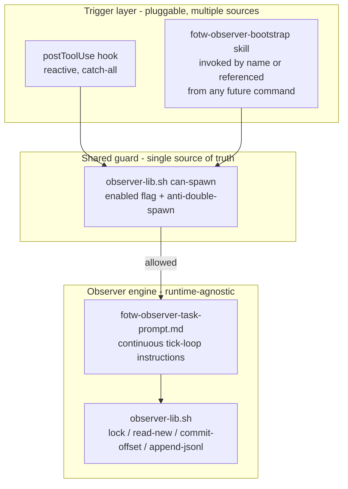

# FOTW observer — install + real trigger integration

**Built ahead of schedule, at explicit operator request.** `lld/OBSERVER-LLD.md` (source: `/Users/vs72964/Downloads/netapp-recipe/`) marks the whole observer **"post-pilot — do not implement for v1 pilot"**, and `BACKLOG.md` slots it as **TASK-013, Wave 4, sprint "Post-pilot"**. This work is opt-in, fully removable, and does not block or reorder any v1 task.

## What changed vs. the earlier hook-trigger spike

The spike (`bench/report/fotw-hook-trigger-spike-report.md`) proved the *mechanism* — hook fires → nudge → background `Task` subagent reads the live transcript with zero primary-session cost — but against a throwaway stand-in file and with no installer at all. Two real-LLD findings drove changes here:

1. **`INSTALL-LLD.md` Step 3 says "Self-driving background loop — not hook-only,"** naming Cursor `/loop` or an Automation as the intended mechanism, gated by an install-time operator-approval human gate. The hook-chain we validated is a real, useful building block (cheap, event-driven, zero-cost) but is *not* the documented primary mechanism — a scheduled Cursor Automation is. That piece (an actual Automation, cron-triggered every 5–10 min per the doc's "Open decisions" table) is **not built** here; it requires the interactive `automate` skill flow (trigger/tool/prompt selection, draft approval, editor handoff) and wasn't in scope for this pass.
2. **There is no bespoke "netapp-gsd PRD command."** `RUNTIME-LLD.md` §1.a confirms PRD intake is a config layer over native GSD commands (`gsd-new-project`, `gsd-import`, `gsd-discuss-phase`, `gsd-ingest-docs`). The concrete, file-level signal is one of the artifacts those commands produce: `docs/PRD.md`, `.planning/intake/PRD.md`, or `.planning/STATE.md` (project bootstrap, immediately follows intake).

## Worked example: PRD intake → subagent spawn

Assumes a future `gsd-netapp` install script has already called `install-observer.sh`, so the target repo has:

```json
// .cursor/hooks.json
{
  "version": 1,
  "hooks": {
    "postToolUse": [
      { "command": ".cursor/hooks/fotw-observer-nudge.sh", "matcher": "Write" }
    ]
  }
}
```

```json
// .gsd-recipe/observer-config.json
{ "enabled": true, ... }
```

**Step 1 — User runs the PRD-intake flow.** E.g. `gsd-new-project --prd my-feature-prd.md`. Somewhere inside that native GSD workflow, the agent calls the `Write` tool to create `.planning/STATE.md` (every project bootstrap does this — it's not recipe-specific).

**Step 2 — Cursor's runtime invokes the hook.** Because `hooks.json` has a `postToolUse` entry matched on `Write`, Cursor pipes a JSON payload to `fotw-observer-nudge.sh` on stdin:

```json
{
  "tool_name": "Write",
  "tool_input": { "file_path": "/repo/.planning/STATE.md" },
  "session_id": "abc-123",
  "transcript_path": "/Users/you/.cursor/.../abc-123.jsonl"
}
```

**Step 3 — Hook script logic runs** (verbatim behavior of `.gsd-recipe/templates/fotw-observer-nudge.sh`):

1. Reads `.gsd-recipe/observer-config.json` → `enabled: true` → continues. (If `false`/missing → prints `{}` and stops — no nudge, fail closed.)
2. Matches `tool_input.file_path` against `*/.planning/STATE.md` → matches → continues.
3. Checks `.gsd-recipe/.observer-active.json` for `session_id: "abc-123"` → not found (first time) → continues.
4. Writes `.gsd-recipe/.observer-target.json`:
   ```json
   { "session_id": "abc-123", "transcript_path": "/Users/you/.cursor/.../abc-123.jsonl", "discovered_at": "...", "matched_signal_path": "/repo/.planning/STATE.md" }
   ```
5. Prints to stdout:
   ```json
   {"additional_context":"FOTW_HOOK_NUDGE: PRD-intake signal detected (...). Spawn the observer now via Task(subagent_type=generalPurpose, run_in_background=true) reading target descriptor at .gsd-recipe/.observer-target.json, then mark .gsd-recipe/.observer-active.json for this session_id."}
   ```

**Step 4 — Cursor injects that as a system reminder into the live conversation.** The primary agent (mid-conversation, running `gsd-new-project`) sees this appear as injected context.

**Step 5 — Primary agent complies (the non-guaranteed step).** If it follows the nudge, it calls:

```
Task(subagent_type="generalPurpose", run_in_background=true, prompt="Read .gsd-recipe/.observer-target.json, tail the transcript at the given path, classify new lines as signal/noise/hedge, append to .learnings/observer/ticks.jsonl...")
```

...then writes `.gsd-recipe/.observer-active.json` with `session_id: "abc-123"` so the next `Write` in this session no longer re-nudges (anti-double-spawn).

The subagent now runs in the background, invisible to the user, ticking against the transcript, at zero token cost to the primary conversation.

**If step 5 doesn't happen** — agent ignores the nudge, or `additional_context` isn't surfaced — no subagent gets spawned. Steps 1–4 are deterministic/mechanical; step 5 depends on agent behavior, not a hard system call. This is the core caveat of the whole mechanism (see "Still not built" below).

## What was built

| Piece | Path | Purpose |
|---|---|---|
| Installer | `.gsd-recipe/scripts/install-observer.sh` | Idempotent, ledger-tracked, fail-closed. `--yes` for scripted installs, `--uninstall` for surgical removal, `--target <repo>` for any target repo. |
| Hook template | `.gsd-recipe/templates/fotw-observer-nudge.sh` | Source of truth; installer stages a copy to `.cursor/hooks/fotw-observer-nudge.sh` in the target repo. |
| Config schema | `.gsd-recipe/observer-config.json` | Adds `"enabled"` flag (fail-closed gate) on top of the spike's tick/rollup config. |

### Installer behavior (validated against 3 scenarios, see below)

- Refuses to run outside a git repo root (fail closed, per `INSTALL-LLD` Step 1).
- Interactive consent prompt unless `--yes` (human gate, per Step 3).
- Merges into an existing `.cursor/hooks.json` without touching unrelated hook entries; creates one fresh if absent.
- Never overwrites an existing `.gsd-recipe/observer-config.json` (preserves operator/spike customization).
- Every file it creates is recorded in `.gsd-recipe/ledger.json` under component `fotw-observer`, for exact, surgical `--uninstall` (removes only what it staged; leaves `.learnings/` data and `observer-config.json` in place, matching `INSTALL-LLD`'s "preserve human data" removal principle).
- Re-running install is a true no-op on already-staged state (no duplicate hook entries, no duplicate ledger rows).

### Hook trigger behavior (repointed + fail-closed)

Old spike matcher: literal `*/.hook-trigger-test.md` stand-in.
New matcher: `*/docs/PRD.md`, `*/.planning/intake/PRD.md`, `*/.planning/STATE.md` — the real PRD-intake/bootstrap artifacts per `RUNTIME-LLD.md` §1.a–1.b.

New fail-closed gate: hook reads `.gsd-recipe/observer-config.json`; no-op if the file is missing (recipe not installed) or `"enabled": false` (operator opted out without a full uninstall).

## Validation performed

| # | Test | Result |
|---|------|--------|
| 1 | Fresh install into an empty temp git repo | PASS — all 6 files staged, ledger correct, config `enabled: true` |
| 2 | Install merging into a pre-existing `hooks.json` with an unrelated hook | PASS — unrelated entry untouched, our entry appended once |
| 3 | Re-run install twice (idempotency) | PASS — `postToolUse` entry count stayed at 2, ledger stayed at 6 rows |
| 4 | Uninstall | PASS — hook script + our `hooks.json` entry removed; unrelated hook entry, `.learnings/`, and `observer-config.json` survived |
| 5 | Hook: irrelevant `Write` path | PASS — silent `{}` |
| 6 | Hook: `Write` to `.planning/STATE.md` | PASS — nudges with `additional_context`, writes `.observer-target.json` |
| 7 | Hook: same session re-fires after active marker set | PASS — anti-double-spawn stays silent |
| 8 | Hook: different session fires independently | PASS — nudges again, scoped per `session_id` |
| 9 | Hook: `"enabled": false` | PASS — silent even on a matching path |
| 10 | Hook: `observer-config.json` missing entirely | PASS — silent (fail closed) |
| 11 | Applied to the real `gsd-benchmark` repo | PASS — merged cleanly against the live spike-era `hooks.json`, left the spike's `observer-config.json` untouched (predates the `enabled` flag; added it by hand to activate) |

Not re-validated in this pass: **live end-to-end hook fire** against the new matcher inside an actual Cursor session (the spike already proved the fire→nudge→subagent chain live; this pass validates the new matcher logic and installer via direct invocation and unit tests, since this conversation's active workspace differs from `gsd-benchmark`).

## Still not built (explicitly out of scope here)

- The documented **self-driving Automation/`/loop`** (the LLD's actual "not hook-only" mechanism) — requires the interactive `automate` skill flow; not attempted.
- Wiring to a **live tracker epic key** in `.planning/STATE.md`'s tracker section (the `started` stamp) — current matcher fires on file *existence*, not on tracker-linkage content.
- Any `gsd capability install` packaging (`ADR-1244` capability ecosystem) — this is the shell fallback path only, per `INSTALL-LLD` Step 2.

## Files

- `.gsd-recipe/scripts/install-observer.sh`
- `.gsd-recipe/templates/fotw-observer-nudge.sh`
- `.gsd-recipe/observer-config.json` (patched: added `"enabled": true`)
- `.gitignore` (added `.learnings/`, `.gsd-recipe/install-report.json` per `INSTALL-LLD`'s documented additions)

---

## Addendum: pluggable trigger + real tick loop

Follow-up pass addressing two gaps flagged above and in the earlier spike's "remaining unknowns" — the trigger being reactive-only, and the subagent only ever running a single classification pass instead of a real loop.

### Why "pluggable"

`recipe-prd-intake` (`BACKLOG.md` TASK-016, Wave 1b) — the natural home for a deterministic PRD-intake trigger — does not exist yet; the operator will build the `netapp-gsd` command layer separately. The trigger therefore cannot be hard-coded into that command today. It had to become a standalone, callable unit any future command can wire in with one line, once it exists — and, more generally, decoupled enough that the observer's *engine* (classification loop) doesn't care which of the (currently two) trigger paths spawned it, or which runtime it's running under (Cursor today; Claude Code CLI explicitly deferred).

### Architecture — three decoupled layers



- **Trigger layer.** The hook (`.cursor/hooks/fotw-observer-nudge.sh`) stays as the reactive catch-all — fires on any matching `Write` regardless of which command produced it. New: `.cursor/skills/fotw-observer-bootstrap/SKILL.md`, a standalone skill invocable by name today, and designed to be referenced as one line ("after PRD intake completes, invoke `fotw-observer-bootstrap`") from a future `recipe-prd-intake` — no shared code duplication required by the caller.
- **Shared guard.** Both trigger paths now call one function — `bench/lib/observer-lib.sh can-spawn <config> <active_marker> <session_id>` — instead of duplicating the enabled/anti-double-spawn checks inline. Single source of truth, independently unit-tested.
- **Observer engine.** `.gsd-recipe/templates/fotw-observer-task-prompt.md` is new: the single spec for what the spawned subagent actually does — a real repeating loop (explicit-stop check → lock → `read-new` → classify → append signal/noise → `commit-offset` → unlock → sleep → repeat), not the one-shot 40-line pass the earlier spike left as an open gap. Both trigger paths point at this same file instead of inlining instructions.

### What changed

| File | Change |
|---|---|
| `bench/lib/observer-lib.sh` | Added `can-spawn` subcommand (shared guard, extracted from the hook's previously-inlined checks) |
| `.gsd-recipe/templates/fotw-observer-nudge.sh` | Delegates to `can-spawn`; nudge text points at the shared task-prompt file instead of inlining spawn instructions |
| `.gsd-recipe/templates/fotw-observer-task-prompt.md` | **New.** Shared continuous tick-loop spec (explicit_stop / inactivity / prd_complete end-triggers, rollup on finalize) |
| `.cursor/skills/fotw-observer-bootstrap/SKILL.md` | **New.** Pluggable trigger, same `<cursor_skill_adapter>` convention as `gsd-jira-sync/SKILL.md` |
| `.gsd-recipe/scripts/install-observer.sh` | Now also stages `.gsd-recipe/lib/observer-lib.sh` (the hook's runtime dependency — previously missing, would have failed at hook-fire time in any real target repo), the task-prompt template, and the skill; `--uninstall` removes all of them; added a `safe_copy` guard + `is_canonical_source` check so self-installing into this implementation repo neither errors (src == dest) nor deletes the canonical template on `--uninstall` |
| `bench/tests/test-install-observer.sh` | **New.** 17 assertions: fail-closed on non-git target, fresh install, hooks.json merge, config preservation, idempotency, full uninstall behavior |
| `bench/tests/test-fotw-observer-nudge.sh` | **New.** 10 assertions covering all matcher paths, anti-double-spawn, per-session scoping, disabled/missing-config fail-closed |
| `bench/tests/test-observer-tick-loop.sh` | **New.** 6 assertions proving a real multi-tick loop: offset advances across ≥3 distinct values (not one-shot), `ticks.jsonl` grows incrementally tick over tick, an explicit stop sentinel halts processing before a subsequent write is read |

### Bug found and fixed during this pass

The hook script called `bench/lib/observer-lib.sh`, which only exists in this implementation repo's dev tree — never staged into any actual target repo by the installer. Any real install would have failed at first hook-fire (`No such file or directory`). Fixed by staging a deployed copy to `.gsd-recipe/lib/observer-lib.sh` and pointing the hook there; caught by re-running the installer test in a clean temp repo rather than only against `gsd-benchmark` itself (which already had the file in its own tree, masking the gap).

### Validation

54 assertions total across the full `bench/tests/` suite (12 + 9 pre-existing, 17 + 10 + 6 new), all passing, including a dedicated check in a disposable copy of this repo that `--uninstall` preserves canonical template sources rather than deleting them in the self-install case.

### Still not built (unchanged from before, plus one addition)

- The documented self-driving Cursor Automation/`/loop`.
- Tying the trigger to a live tracker epic-link (`started` stamp) rather than file existence.
- `gsd capability install` packaging.
- **New:** `recipe-prd-intake` itself does not exist — `fotw-observer-bootstrap` is ready to be referenced from it the moment it does, but nothing calls the skill automatically today.

---

## Addendum 2: conflict-checking restored into Finalize (KISS, no new mechanism)

A follow-up review noticed the generalized `fotw-observer-task-prompt.md` had silently dropped a capability the original feasibility spike demonstrated by hand: comparing new session signal against existing knowledge and flagging contradictions. Evidence the spike already did this successfully, found in this repo's own `.learnings/kb/`:

- `.learnings/kb/sessions/run1-rollup-02.md` — a session summary that noticed a value ("retry cap") changed *within the same session* and called it out in plain prose.
- `.learnings/kb/playbooks/notification-retry-policy.md` — an existing playbook edited to `status: contradictory`, with `contradicts: [...]` (pointing at the conflicting session summaries) and a `contradiction_note:` field explaining exactly what differs.

No bespoke "conflict engine" was ever built or needed — the same LLM judgment already doing classification and summarization just read the existing KB files before writing new ones, and used three plain frontmatter fields to record what it found. `fotw-observer-task-prompt.md`'s Finalize section now explicitly instructs this: read `paths.kb_sessions_dir` / `paths.kb_playbooks_dir` before writing a new session summary (step 2), compare against both prior ticks in the same session and existing files (step 3), and — if an existing playbook conflicts — edit it in place with the `status`/`contradicts`/`contradiction_note` schema rather than silently overwriting it (step 4). Conflicting entries are never deleted, only flagged, preserving both sides for human review at the `gsd-extract-learnings` promotion gate.

---

## Addendum 3: how to manually trigger the observer from a separate chat

Both trigger paths spawn the same background subagent (`fotw-observer-task-prompt.md`); pick whichever fits the test.

### Option A — invoke the skill by name (works today, in any chat on this repo)

In a separate chat/session on this repo, ask the agent to invoke `fotw-observer-bootstrap` by name. Per its `<cursor_skill_adapter>`, it will:
1. Run the shared guard: `.gsd-recipe/lib/observer-lib.sh can-spawn .gsd-recipe/observer-config.json .gsd-recipe/.observer-active.json <session_id>`.
2. If allowed: write `.gsd-recipe/.observer-target.json`, spawn a background `Task` per `fotw-observer-task-prompt.md`, mark `.gsd-recipe/.observer-active.json`.

**Preconditions to check in that chat's repo first:**
- `.gsd-recipe/observer-config.json` exists with `"enabled": true`.
- `.gsd-recipe/.observer-active.json` doesn't already list that session's `session_id` (it's a single global marker, not per-session storage — `rm` it to force a fresh spawn while testing from multiple chats).

### Option B — reactive hook (no explicit ask; best-effort)

Have that chat's agent `Write` to `docs/PRD.md`, `.planning/intake/PRD.md`, or `.planning/STATE.md`. The installed hook (`.cursor/hooks/fotw-observer-nudge.sh`) fires automatically and injects an `additional_context` nudge asking the agent to spawn the observer — this depends on the agent noticing and complying with the nudge, unlike Option A.

### Verifying it spawned and is working

```bash
cat .gsd-recipe/.observer-active.json      # session_id now marked active
tail -f .learnings/observer/ticks.jsonl    # grows as new lines get classified
tail -f .learnings/observer/noise-log.jsonl
```

After it finalizes (explicit stop via `touch .learnings/observer/.stop`, inactivity, or PRD-complete detection):

```bash
ls .learnings/kb/sessions/     # new session summary
ls .learnings/kb/playbooks/    # only if signal count crossed rollup_threshold_signal_lines
```
