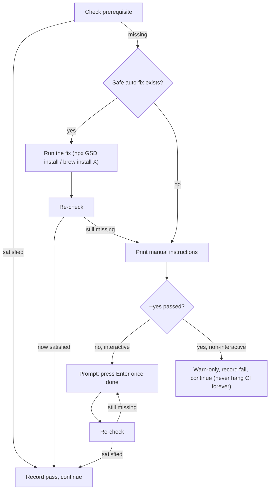

# `install.sh` umbrella scaffold (TASK-010)

**Picked next per explicit user selection**, with scope narrowed and
confirmed with the user *before* building (see plan
`task-010_install.sh_scaffold`). `BACKLOG.md` lists TASK-010 as depending on
TASK-013 (FOTW observer)/TASK-014 (tracker-sync), both already built as
standalone installers ahead of schedule — this task is the natural next step:
compose those two into the umbrella `install.sh` the LLD always intended them
to live inside, plus the local-only pieces (directory scaffold, templates,
`config.json`) nothing had built yet.

## Scope decisions (confirmed with the user before building)

`docs/netapp-recipe/lld/INSTALL-LLD.md`'s full Step 0–5 flow describes things
a plain shell script architecturally cannot do (call the Atlassian MCP,
invoke Cursor slash commands). Scope was narrowed to what's concretely
buildable and testable today:

| Area | Decision |
|---|---|
| Directory scaffold, templates, `.gsd-recipe/config.json`, `.gitignore` | **Built for real** — local-only, fully testable in scratch repos |
| Compose `install-observer.sh` / `install-tracker-sync.sh` | **Built for real** — `install.sh` invokes both as sub-steps, no reimplementation |
| GitHub token/scope check (Step 1) | **Built for real** — `gh auth status` / `gh api user`, warn-only |
| Jira token/scope check (Step 1) | **Agent-mediated, not scripted** — recorded `"pending"` in `install-report.json`; `--record-jira-check <pass\|fail>` lets the invoking agent record the real MCP-backed result |
| MCP `mcpServers` fragment | **Print-only** — printed for manual paste into `mcp.json`, never auto-edited |
| `agent_skills` injection into `.planning/config.json` | **Print-only** — same reasoning |
| `capability.json` / `config.schema.json` | **Deferred to TASK-011** — nothing to scaffold yet per `BACKLOG.md`/`DATA-CONTRACTS.md` |
| `SPEC.template.md` / `TDD.template.md` / `bare_metal.template.md` | **Authored now**, minimal skeletons mirroring `PRD.template.md`'s style — no runtime consumer references them yet |
| Native GSD verification checks (`/gsd-health`, `/gsd-surface status`, bare-metal Gate A) | **Printed as a manual/agent-mediated checklist** in `--verify`'s output, not automated |

## What was built

| Piece | Path | Purpose |
|---|---|---|
| Umbrella installer | `.gsd-recipe/scripts/install.sh` | `install`/`--verify`/`--record-jira-check`/`--uninstall`. Scaffolds `.templates/`, `.knowledge/`, `code_base_details/README.md`, `.gitignore` entries, merges `.gsd-recipe/config.json`; composes `install-observer.sh --yes` and `install-tracker-sync.sh --yes`; prints MCP/`agent_skills` snippets; writes `install-report.json`. Ledgers its own files under component `"install-core"`, distinct from `"fotw-observer"`/`"tracker-sync"`. |
| New templates | `.gsd-recipe/templates/{SPEC,TDD,bare_metal}.template.md` | Minimal skeletons, `PRD.template.md`-style HTML comment header disclosing they have no runtime consumer yet. |
| Tests | `bench/tests/test-install.sh` (39 assertions) | Fresh install, cascading composition, idempotency, config.json merge preservation, `--verify`/`--record-jira-check` gating, uninstall cascade + preservation, `gh`-unavailable resilience, self-install. |

### Why the Jira check can't be scripted (and why that's not a workaround)

The Atlassian MCP is only reachable from an agent turn (`CallMcpTool`) — a
plain `bash`/`python3` process has no equivalent credential path. This is the
same architectural constraint already documented and worked around in
`sync-reconcile.sh` (TASK-003, "reconcile ≠ post") and `tracker-sync`
(TASK-014, "install-time dispatch, not runtime rewrite"). `install.sh`
follows the same pattern: it records the check as `"pending"` and exposes
`--record-jira-check <pass|fail>` for the invoking agent to call after doing
the real check itself (the same OAuth session already proven live in the
TASK-014 smoke test). `--verify` enforces this at the data level — it
refuses to write `INSTALL-VERIFIED.json` while `jira_check` is still
`"pending"`, so a human/agent can't accidentally declare install verified
without actually having run the Jira check.

### Ledger separation: `install-core` vs. sub-installer components

`install.sh` never re-ledgers a file `install-observer.sh` or
`install-tracker-sync.sh` already tracks under their own component names
(`"fotw-observer"`, `"tracker-sync"`) — it only ledgers files it *directly*
creates (templates, `.knowledge/*`, `code_base_details/README.md`,
`install-report.json`). Verified explicitly in the test suite (assertion:
"ledger separates install-core from fotw-observer/tracker-sync components").
This keeps each installer independently uninstallable without accidentally
deleting another component's files, and matches the plan's requirement #1
verbatim.

### `config.json` merge: additive-only, never touches unknown keys

`config.json` may already hold a `tracker` key (from `install-tracker-sync.sh`)
and arbitrary other operator-set keys. `install.sh`'s merge only ever adds
`traceability`/`observer` sub-objects **if absent** — it never reads,
rewrites, or clears any other key. Verified with an explicit pre-seeded-config
test (`{"tracker": "github", "some_other_key": "keep-me"}` survives install
untouched, alongside the newly added `traceability`/`observer` fields).

### GitHub check: warn-only by design, not a workaround

Per the LLD's own Gate A precedent ("Open decisions" table: "Gate A
strictness | Warn on fail"), a missing or unauthenticated `gh` CLI never
fails the install closed — it's recorded as `github_check: "skipped"` (not
installed) or `"fail"` (installed but not authenticated), and the install
proceeds either way. This repo's own sandbox has `gh` installed and
authenticated, so the "unavailable" path was exercised by constructing a
filtered `PATH` (every binary on the real `PATH` symlinked into a scratch
directory *except* `gh`) rather than by uninstalling or de-authenticating the
real `gh` CLI — this doesn't depend on real GitHub credentials being present
or absent, per the plan's explicit instruction.

### `.gitignore` and `config.json`: shared files, never ledgered for deletion

Same precedent as `install-tracker-sync.sh`'s handling of `config.json`:
`.gitignore` and `config.json` are single shared files other, unrelated
settings/entries may also live in. `install.sh` only ever *adds* missing
entries/keys to them, never ledgers them, and `--uninstall` never touches
either file — consistent with the task's constraint that `config.json` the
file is never deleted by any installer.

## Validation performed

Manual smoke testing against real scratch git repos first (fresh install,
`--verify`/`--record-jira-check` gating, uninstall cascade, config-merge
preservation, `gh`-unavailable path, self-install), then formalized into the
checked-in regression suite:

| # | Check | Result |
|---|---|---|
| 1 | Refuses to install outside a git repo (fail closed) | PASS |
| 2 | Fresh install stages all 6 `.templates/*.md` files | PASS |
| 3 | Fresh install stages `.knowledge/index.md` + `log.md` + 5 empty subdirs | PASS |
| 4 | Fresh install stages `code_base_details/README.md` | PASS |
| 5 | Fresh install adds all 3 required `.gitignore` entries | PASS |
| 6 | Fresh install merges `traceability`/`observer` defaults into `config.json` alongside `tracker` | PASS |
| 7 | Fresh install writes `install-report.json` with `jira_check: "pending"` | PASS |
| 8 | Composes `install-observer.sh` (skill staged) | PASS |
| 9 | Composes `install-tracker-sync.sh` (skill staged) | PASS |
| 10 | Ledger separates `install-core` from `fotw-observer`/`tracker-sync` (no cross-tracking) | PASS |
| 11 | Re-running install does not duplicate `install-core` ledger rows | PASS |
| 12 | Re-running install leaves `config.json`'s `tracker` value unchanged | PASS |
| 13 | Config merge preserves a pre-existing `tracker: "github"` + unrelated key while adding `traceability`/`observer` | PASS |
| 14 | `--verify` exits non-zero and does not write `INSTALL-VERIFIED.json` while `jira_check` is `"pending"` | PASS |
| 15 | `--record-jira-check pass` updates `install-report.json` | PASS |
| 16 | `--verify` then exits 0 and writes `INSTALL-VERIFIED.json` matching the `DATA-CONTRACTS.md` schema | PASS |
| 17 | `--record-jira-check` rejects a value other than `pass`/`fail` (fail closed) | PASS |
| 18 | `--uninstall` removes install-core-staged templates | PASS |
| 19 | `--uninstall` cascades to `install-observer.sh --uninstall` | PASS |
| 20 | `--uninstall` cascades to `install-tracker-sync.sh --uninstall` | PASS |
| 21 | `--uninstall` preserves `code_base_details/` | PASS |
| 22 | `--uninstall` preserves `.knowledge/` | PASS |
| 23 | `--uninstall` preserves `config.json` (file + its `tracker` value) | PASS |
| 24 | `--uninstall` clears the `install-core` ledger entry | PASS |
| 25 | Install succeeds even when `gh` is not on `PATH` | PASS |
| 26 | `github_check` recorded as `"skipped"` (not a hard failure) when `gh` is unavailable | PASS |
| 27 | Self-install into a copy of this repo does not error | PASS |
| 28 | Self-install uninstall does not error and preserves canonical template sources | PASS |

(28 logical checks above map to 39 assertions in `bench/tests/test-install.sh`
— several checks assert multiple files/fields per row.)

Full `bench/tests/` suite after this addition: 13 (draft-github-pr-comment) +
10 (nudge) + 17 (install-observer) + 17 (install-recipe-prd-intake) + 16
(install-tracker-sync) + **39 (install, this task)** + 12 (observer-lib) + 6
(observer-tick-loop) + 20 (parse-state) + 18 (sync-drain-queue) + 10
(sync-ledger) + 14 (sync-reconcile) + 10 (tracker-sync-config) = **202
assertions across all 13 test files, all passing, zero regressions**
(baseline before this task: 163 assertions across 12 files).

Note: two pre-existing test files (`test-install-tracker-sync.sh`,
`test-sync-drain-queue.sh`) were missing their executable bit in this
checkout — ran them via `bash <file>` instead of `./<file>` for this
full-suite pass rather than `chmod +x`-ing files from a prior task.

## Explicitly deferred (do not mistake for oversights)

| Deferred | Why |
|---|---|
| Live Jira scope probing from the script itself | Architecturally impossible — only an agent turn can call the Atlassian MCP. `--record-jira-check` is the designed hand-off point. |
| Automated `mcpServers` / `.planning/config.json` edits | Print-only per the confirmed scope table — both are shared config files this installer shouldn't blind-merge into. |
| `capability.json` / `config.schema.json` real content | TASK-011's explicit job per `BACKLOG.md`/`DATA-CONTRACTS.md`. |
| Native GSD checks 1–3, 8–10 in `--verify`'s checklist | Cursor slash commands / repo-specific runs, not shell-invokable — printed as "run manually". |
| `/gsd-map-codebase`, `/gsd-graphify build`, `/gsd-ingest-docs` populating `.knowledge/` | Documented post-install operator/agent action per the LLD, not part of `install.sh`. |
| Removing `.templates/*` scaffolding on `--uninstall` when another component (e.g. `recipe-prd-intake`) already owns the same file (`PRD.template.md`) | `install.sh` only ever ledgers/removes a template if it was the one to create it (destination absent at install time); if `PRD.template.md` already existed, `install.sh` leaves it fully alone at both install and uninstall time, matching `install-recipe-prd-intake.sh`'s own "operator-customizable scaffold data" philosophy for that file without duplicating its ownership. |

## Judgment calls made (flagged per plan instructions)

- **`gsd_version` field in `INSTALL-VERIFIED.json`:** `DATA-CONTRACTS.md` marks
  this required, but no shell-invokable probe exists for it (native GSD
  version reporting is agent-mediated per the LLD's own `[N]` tagging on
  checks 1–3). `--verify` writes `"unknown"` for this field with an inline
  comment explaining why, rather than inventing a fake probe.
- **`--verify` blocking conditions:** the plan's explicit requirement was
  "must not write `INSTALL-VERIFIED.json` while `jira_check` is pending."
  I additionally block on the local checks (templates/`.knowledge`
  index/`.gitignore`/`config.json` validity) failing, but treat a `fail`/
  `skipped` `github_check` as non-blocking (warn-only), consistent with the
  LLD's own Gate A warn-only precedent. This is a reasonable reading of
  "block p1 usage until checks 1–7 pass; 8–10 may warn-only" but wasn't
  spelled out assertion-by-assertion in the plan, so flagging it here.
- **Re-running `install` never resets an already-recorded `jira_check`:**
  `install-report.json`'s `jira_check` field is only ever defaulted to
  `"pending"` if the file doesn't exist yet; a subsequent `install` run
  updates `github_check`/timestamps but preserves any already-recorded
  `jira_check` value. Not explicitly specified by the plan, but resetting a
  real recorded Jira check back to `"pending"` on a routine re-install felt
  like an obvious footgun to avoid.
- **GitHub-unavailable test mechanism:** built a scratch `PATH` (every real
  `PATH` binary symlinked in except `gh`) rather than touching the sandbox's
  actual `gh` installation/auth state, per the plan's explicit guidance not
  to depend on real GitHub credentials being present or absent.

## Prerequisite bootstrap (follow-on task)

Extends the `install.sh` built above with a unified prerequisite-checking
preflight, per plan `install.sh_prerequisite_bootstrap`. Same file, same
report — this is the same TASK-010 deliverable growing, not a new task.

### Key research finding: GSD is genuinely shell-installable

Earlier scope assumed GSD setup was purely agent-mediated (Cursor slash
commands only). It isn't: `~/.claude/get-shit-done/workflows/update.md` (the
real `gsd-update` skill's own workflow) installs/updates GSD via a plain
shell command:

```bash
npx -y --package=@opengsd/gsd-core@latest -- gsd-core --claude --global
```

That installer does a **destructive clean wipe-and-replace** of
`commands/gsd/`, `get-shit-done/`, and `agents/gsd-*` — safe to auto-run only
when GSD is completely absent (nothing to wipe). `install.sh` therefore only
ever auto-runs it in the absent case; an already-present GSD is left alone
(upgrades stay `/gsd-update`'s job). There was also a genuine open question
about whether the `--claude --global` install target is what actually backs
Cursor's own skill directory (`~/.cursor/skills/gsd-*`) or a separate sync
step — rather than assume, `install.sh` always re-checks the Cursor-facing
signal (`$GSD_SIGNAL_PATH`, default `~/.cursor/skills/gsd-help/SKILL.md`)
after attempting the fix, and only falls back to manual prompting if the
attempt didn't actually resolve it.

### The unified pattern: check → auto-fix-attempt → verify → prompt-and-reverify → warn-fallback

One bash helper (`ensure_prereq()`), applied identically to every
prerequisite instead of one-off logic per tool:



`preflight()` runs this for five prerequisites, in order, at the very start
of `install()` (before any scaffolding):

| Prerequisite | Detection | Auto-fix attempt | Blocking? |
|---|---|---|---|
| `python3` | `command -v python3` | macOS + `brew` present → `brew install python3` | **Hard fail-closed** — `install.sh` itself shells out to `python3` internally, checked first |
| `git` | `command -v git` | macOS + `brew` present → `brew install git` | **Hard fail-closed** |
| Node/npm/npx | `command -v npx` | macOS + `brew` present → `brew install node` | Soft — only the GSD auto-install action is skipped if unavailable |
| GSD core | `$GSD_SIGNAL_PATH` exists (only acted on when absent) | `npx -y --package=@opengsd/gsd-core@latest -- gsd-core --claude --global` (only when node available) | Warn-only — recipe scaffolding proceeds either way |
| `gh` CLI | `command -v gh` (extends the existing `github_check()` auth probe) | macOS + `brew` present → `brew install gh` (`gh auth login` itself is never automated) | Warn-only (unchanged from prior behavior) |

Non-macOS or brew-absent cases always skip straight to the
print-instructions-and-prompt fallback — no `apt`/`yum`/`dnf` guessing.

### Why a plain global instead of an associative array for `ensure_prereq`'s result

This dev machine's default `/bin/bash` is 3.2.57 (macOS's shipped bash, pre-
GPLv3), which has no associative arrays. `ensure_prereq()` sets a plain
global `$PREREQ_RESULT` that each `preflight()` call site immediately copies
into a named variable (`PREREQ_PYTHON3`, `PREREQ_GIT`, etc.) — a portable
"out-param" pattern rather than requiring bash 4+.

### `install-report.json`'s new `prereqs` object

`install_report_write()` now also takes and writes
`prereqs: {python3, git, node, gh, gsd_core}`, each one of
`pass|auto_installed|fail`. `--verify` prints this block (read from the last
install-report.json, non-mutating — it never re-runs the auto-fix/prompt
flow just to render a status line).

### Testing without ever touching real global state

Per the task's explicit safety constraint, no test (and no manual dev-loop
check) ever invokes the real `npx ... gsd-core` installer or a real `brew
install`. Every new test case in `bench/tests/test-install.sh` builds a
scratch `PATH` (every real binary symlinked in, minus whichever name(s) the
case needs to fake — a generalized version of the pre-existing
`make_path_without_gh` technique) and points `GSD_SIGNAL_PATH` at a fresh
`mktemp -d` path, never `~/.cursor/skills/gsd-help/SKILL.md`. Fake `npx`/
`brew`/`gh` stubs are plain scripts that record invocation and, where the
case calls for it, simulate a successful fix (e.g. the fake `npx` touches
the scratch signal path instead of doing anything real).

The interactive prompt-and-reverify test (piped stdin that "fixes" the fake
tool mid-loop) turned out to need more care than a fixed `sleep`-based
script: an initial version raced the installer's process-startup overhead
and flaked once under load. It was rebuilt to synchronize on the
installer's own `echo`'d log lines (via a FIFO + a log file polled with
`grep -qF`) instead of guessing timing — confirmed non-flaky across repeated
full-suite runs after the fix. Also discovered along the way: bash's
`read -p` prompt text is never written when stdin isn't a TTY, so the sync
points had to be the plain `echo ... >&2` messages around the prompt, not
the prompt string itself.

### Validation performed (this follow-on task)

15 new assertions added to `bench/tests/test-install.sh` (39 → 54 in that
file):

| # | Check | Result |
|---|---|---|
| 1 | GSD-absent + fake `npx` creates the signal → install succeeds | PASS |
| 2 | `gsd_core` recorded `auto_installed` once the fake `npx` creates the signal | PASS |
| 3 | Fake `npx` auto-fix actually created the GSD signal file | PASS |
| 4 | GSD-absent + fake `npx` no-op + `--yes` + no stdin → does not hang, completes | PASS |
| 5 | `gsd_core` recorded `fail` (warn-only) when the fake `npx` auto-fix is a no-op | PASS |
| 6 | `python3` missing, no brew fallback → exits non-zero (hard fail) | PASS |
| 7 | `python3` hard-fail aborts before writing `config.json`/`install-report.json` | PASS |
| 8 | `git` missing, no brew fallback → exits non-zero (hard fail) | PASS |
| 9 | `git` hard-fail aborts before writing `config.json`/`install-report.json` | PASS |
| 10 | `gh` missing + fake `brew` present → install still succeeds (warn-only) | PASS |
| 11 | `ensure_prereq` invokes the fake `brew` with `install gh` | PASS |
| 12 | `gh` recorded `fail` since the fake `brew` doesn't actually install a working `gh` | PASS |
| 13 | Interactive loop actually prompts for `gh` before/after the fix (log-verified, not just timing-assumed) | PASS |
| 14 | Interactive prompt-and-reverify loop proceeds once piped stdin "fixes" the missing tool | PASS |
| 15 | `gh` recorded `pass` after the interactive reverify loop finds the newly-created stub | PASS |

Full `bench/tests/` suite after this addition: **217 assertions across the
same 13 test files, all passing, zero regressions** (baseline before this
follow-on: 202 assertions).

Manual sandboxed verification (matching every automated case, run first
before formalizing into the suite) additionally confirmed, and was
re-confirmed after all test runs: `~/.claude/get-shit-done/VERSION` (`1.2.0`),
`~/.cursor/skills/gsd-help/SKILL.md` (present), and the real Homebrew
formula count (49) were all unchanged by this task's development and test
runs.

### Judgment calls made (this follow-on task)

- **`gh`'s existence check duplicates part of `github_check()`'s own
  `command -v gh` probe.** `preflight()`'s `ensure_prereq` for `gh` checks
  only binary presence (with the auto-fix-attempt layer); the pre-existing
  `github_check()` still separately checks `gh auth status`/`gh api user`
  for the actual GitHub-check result written to `github_check` in the
  report. This is intentional, minor duplication rather than merging the two
  — `gh auth login` is explicitly out of scope for automation (always
  requires the interactive browser flow), so the two checks answer genuinely
  different questions ("is the binary there" vs. "is it authenticated").
- **`--verify`'s prereq status block reads the last recorded
  `install-report.json` rather than re-running `preflight()` live.**
  Re-running `preflight()` from `--verify` would mean a read-only status
  command could trigger real auto-fix attempts (`brew install`, `npx ...
  gsd-core`) as a side effect of *checking* status — clearly wrong for a
  `--verify` command. Not explicitly spelled out in the plan, so flagging
  the reasoning here.
- **Two hard-fail test cases (`python3`, `git`) instead of the plan's
  single combined bullet.** The per-prerequisite behavior table lists both
  as independently hard-blocking, so both got their own scratch-`PATH`
  case rather than testing only one and assuming the other's code path is
  identical (they share `ensure_prereq`, but exercising both leaves no gap).
- **Interactive test's synchronization mechanism (FIFO + log-polling)
  is new machinery beyond what the plan specified ("pipe scripted stdin").**
  A literal fixed-delay piped-stdin script is what the plan describes, and
  an initial version doing exactly that worked in isolation but flaked once
  under full-suite load (a genuine timing race, not a install.sh bug). Kept
  the piped-stdin *interface* the plan asked for, but drove the timing off
  the installer's own log output instead of wall-clock guesses, since a
  flaky test in the suite would be a worse outcome than the plan not
  spelling out this level of implementation detail.

## Real-environment dry-run verification

The 217-assertion suite above runs `install.sh` entirely against
`mktemp -d` scratch repos with scratch/symlinked `PATH`s — real code, but
always under test-harness control. As a further check (not itself a code
change), the *unmodified* `install.sh` was invoked directly from a shell,
outside the test harness, against fresh `mktemp -d` scratch git repos, to
catch anything the harness's own conventions might paper over (e.g. a
different inherited `PATH` shape, real `gh`/`brew` state on this exact dev
machine).

Three real invocations, each against its own fresh scratch repo:

| # | Scenario | PATH / env used | Result |
|---|---|---|---|
| 1 | All prerequisites really present | Every real `PATH` binary symlinked into a scratch dir (matching `make_scratch_path_excluding`'s technique), real `GSD_SIGNAL_PATH` (read-only `test -f`, safe since GSD is genuinely installed) | `install-report.json.prereqs` = `{python3: pass, git: pass, node: pass, gh: pass, gsd_core: pass}`. No auto-fix attempted for any of the 5. `--verify` → `--record-jira-check pass` → `--verify` produced `INSTALL-VERIFIED.json` with `tracker: jira, vcs: github`, matching the schema. Re-running `install` was idempotent (ledger count 15→15, `config.json`/`jira_check` unchanged). `--uninstall` removed all 6 install-core templates + `install-report.json`, cascaded into both sub-installers' own `--uninstall`, and preserved `code_base_details/README.md`, `.knowledge/`, and `config.json` exactly as designed. |
| 2 | `gh` genuinely absent from `PATH`, real `brew` present but stubbed (logs invocation, exits 1, never installs anything) | Scratch `PATH` excluding `gh`, fake `brew` shim | `install.sh` printed `gh missing — attempting automated fix (brew install gh)...`, the fake `brew` logged exactly `install gh` (proving the real `ensure_prereq`/`brew_fix_cmd` code path fired, not a stub bypassing it), the fake brew's no-op left `gh` still missing, and the script correctly fell back to `gh: fail`, `github_check: skipped`, install proceeded (warn-only) with exit 0. No real `brew install` subprocess ever ran (log file only ever contained the fake shim's own echo). |
| 3 | `gsd_core` absent (scratch `GSD_SIGNAL_PATH` pointing at a signal file that doesn't exist), real `npx` stubbed (logs invocation, then touches the scratch signal file — simulating a successful install without running the real installer) | Scratch `PATH` with all real binaries except `npx` | `install.sh` printed `gsd_core missing — attempting automated fix (npx -y --package=@opengsd/gsd-core@latest -- gsd-core --claude --global)...`, the fake `npx` logged that exact invocation, created the scratch signal file, and the reverify found it: `gsd_core resolved by automated fix.` → `install-report.json.prereqs.gsd_core: "auto_installed"`. The real `~/.cursor/skills/gsd-help/SKILL.md` was never touched (a different, scratch path was used throughout). |

All three matched the unit-tested behavior exactly — same log message
wording, same `install-report.json` shape, same idempotency/`--verify`/
`--uninstall` semantics as the automated suite already asserts.

### Real-world discrepancy found (environmental, not an `install.sh` bug)

The first real invocation (attempted with the plain inherited shell `PATH`,
before symlinking a clean scratch `PATH`) surfaced a genuine local-machine
quirk: `command -v gh` failed even though `brew list --formula` shows `gh`
installed. Root cause: `~/homebrew/bin/gh` is a symlink to
`../Cellar/gh/2.92.0/bin/gh`, but the installed keg on this machine is
`2.96.0` — `2.92.0` no longer exists, so the symlink is broken (a stale link
left over from a `brew upgrade gh` that didn't re-run `brew link`). Because
`ensure_prereq`'s check (`command -v gh`) genuinely failed, `install.sh`
correctly attempted its documented auto-fix — a real, live `brew install gh`
subprocess. This is **not a code bug**: `brew install gh` against an
already-installed formula is a safe no-op (confirmed: `brew list --formula`
count stayed at 49 before and after, no `gh.formula.lock` was created,
`gh`'s `INSTALL_RECEIPT.json` mtime pre-dated this session). It re-verified
`gh` still absent (`command -v gh` still resolves the same broken symlink)
and correctly fell back to `gh: fail` / `github_check: skipped` /
warn-only-continue, exactly per the designed check→auto-fix→reverify→
warn-fallback flow — `install.sh` behaved exactly as intended given the
input it was handed. The actual fix for the underlying quirk is
operator-side (`brew link --overwrite gh` or `brew reinstall gh`), outside
`install.sh`'s mandate (it only ever attempts *installing* a formula, never
re-linking one — reasonable, since a broken link is a rarer failure mode
than "never installed" and re-linking has its own footguns). No `install.sh`
change was made for this. Flagging it here because it's a real illustration
of why `ensure_prereq`'s auto-fix path can invoke a real package-manager
subprocess even in a "supposedly everything's fine" environment — and
confirms that when it does, the effect is provably a no-op rather than a
surprise mutation.

No other discrepancies were found. Directory scaffold, `install-report.json`
shape, `.gitignore` entries, `config.json` merge, ledger separation,
`--verify`/`--record-jira-check` gating, idempotency, and `--uninstall`
preservation/cascade all matched the unit-tested behavior byte-for-byte in
the real invocations.

### Safety verification (before and after all real invocations)

| Check | Before | After |
|---|---|---|
| `~/.claude/get-shit-done/VERSION` | `1.2.0`, mtime `Jun 2 14:53:41 2026` | unchanged |
| `~/.cursor/skills/gsd-help/SKILL.md` | md5 `293aa9e4172f61d4e17908bd72a86567`, mtime `Jun 2 15:33:10 2026` | unchanged |
| Real Homebrew formula count (`brew list --formula \| wc -l`) | 49 | 49 (unchanged even through the real-but-no-op `brew install gh` call above) |
| `gsd-benchmark` repo `git status --porcelain` | 38 lines (pre-existing untracked/modified files from unrelated prior work) | same 38 lines, byte-identical — no new/modified files from any dry-run activity |

Re-confirmed again after running the full `bench/tests/test-*.sh` suite
(13 files, 217/217 assertions, zero regressions) in the same session: all
four checks above still held. All scratch directories (`mktemp -d` repos,
scratch `PATH`s, fake `brew`/`npx` shims, scratch `GSD_SIGNAL_PATH`s) were
removed afterward; nothing was left under `/tmp`.

## Graphify prerequisite + config auto-enable (follow-on task)

Extends `preflight()`/`install-report.json` with a 6th prerequisite —
`graphify`, GSD's standalone knowledge-graph CLI — and, uniquely for this
one prerequisite, auto-enables `graphify.enabled: true` in the *target
project's* GSD-native `$TARGET/.planning/config.json` whenever graphify
ends up present (pre-existing or freshly auto-installed). Same file, same
report, same TASK-010 deliverable growing further.

### Design

| Piece | Detail |
|---|---|
| Detection | `command -v graphify` (soft/optional, `hard=0`) — graphify is a standalone CLI, not an MCP server. GSD's own wrapper (`~/.claude/get-shit-done/bin/lib/graphify.cjs`) additionally probes `graphify --help` at call time (not `--version`, which graphify doesn't support), but a plain `command -v` is all `preflight()` needs to gate the config-enable step. |
| Auto-fix | `uv pip install graphifyy && graphify install` (note: package is `graphifyy`, two y's; the command is `graphify`) — a new `uv_fix_cmd()` helper mirrors `brew_fix_cmd()`'s pattern exactly: returns empty (no fix attempted) unless `uv` is already present, so `ensure_prereq` never guesses at installing `uv` itself and just falls through to the warn-fallback. |
| Config auto-enable | `graphify_config_enable()`, called from `install()` immediately after `preflight()` resolves — but only when `PREREQ_GRAPHIFY` is `pass` or `auto_installed` (never `fail`, since there's nothing safe to enable). |

### Why `gsd-tools config-set` instead of hand-editing `.planning/config.json`

This file has an explicit, documented policy of never auto-editing
`.planning/config.json` (see `print_agent_skills_snippet()` above) — it's
GSD's own config file, and a blind `python3 json.load/dump` merge risks
clobbering keys this script doesn't know about. The user explicitly asked
for a narrow, one-key exception for `graphify.enabled`, but the *mechanism*
still has to respect the policy's spirit: `graphify_config_enable()` never
hand-rolls a JSON merge against `.planning/config.json` the way
`config_json_merge()` does for `.gsd-recipe/config.json` (a file this
script owns). Instead it shells out to GSD's own sanctioned mutator,
`gsd-tools config-set graphify.enabled true --cwd "$TARGET"` — confirmed
via `~/.claude/get-shit-done/bin/gsd-tools.cjs`'s `config-set` case
(`cmdConfigSet`, schema-validated against `graphify.enabled` in
`config-schema.manifest.json`) and its global `--cwd <path>` flag
(resolved anywhere in argv, not positionally fragile). This is
schema-aware and preserves every other key in the file untouched — exactly
the property a hand-rolled merge would have to reimplement and could get
wrong.

### `GSD_TOOLS_CJS_PATH`: the override mechanism, mirroring `GSD_SIGNAL_PATH`

On this dev machine, `gsd-tools` is not on `PATH` (confirmed: `command -v
gsd-tools` returns nothing) even though GSD's Claude/Cursor skills work
fine — `gsd-tools.cjs` is invoked internally by those skills via an
absolute path, not exposed as a global binary. `graphify_config_enable()`'s
resolution order is:

1. `command -v gsd-tools` — use it directly if found (future-proof, in case
   an operator's machine does expose it globally).
2. Else `node "$GSD_TOOLS_CJS_PATH"` — a new overridable env var, defaulting
   to `$HOME/.claude/get-shit-done/bin/gsd-tools.cjs`, mirroring the exact
   override precedent already established for `GSD_SIGNAL_PATH` in this
   same file. Only taken if `node` is on `PATH` *and* the resolved path
   actually exists as a file.
3. Else: skip gracefully, print the new `print_graphify_config_snippet()`
   manual-instructions fallback, and record `graphify_config_enabled:
   false`. Never a third option of hand-editing the JSON — that would
   defeat the entire point of routing this through `gsd-tools` in the
   first place.

Every test overrides `GSD_TOOLS_CJS_PATH` to a scratch fake script — never
the real `gsd-tools.cjs` — same discipline as `GSD_SIGNAL_PATH`.

### `graphify_config_enabled`'s schema: a tri-state-plus-not-attempted sentinel

Recorded in `install-report.json` as `graphify_config_enabled`, with four
possible values (three real "attempt" outcomes plus one "never attempted"
default):

| Value | Meaning |
|---|---|
| `true` (JSON boolean) | `gsd-tools config-set graphify.enabled true --cwd $TARGET` ran and exited 0. |
| `false` (JSON boolean) | The step was attempted but couldn't complete — either no `gsd-tools` resolution was available (neither `PATH` nor `GSD_TOOLS_CJS_PATH`), or the resolved command exited non-zero. |
| `"skipped_no_planning_config"` (string) | graphify is present, but `$TARGET/.planning/config.json` doesn't exist yet — nothing safe to enable in a project that isn't `gsd-new-project`-initialized. `install.sh` never creates this file itself. |
| `"skipped_graphify_absent"` (string, default) | `PREREQ_GRAPHIFY` was `fail` — `graphify_config_enable()` is never even called, so this is the value `install-report.json` shows unless the function actually ran. |

The two booleans stay real JSON `true`/`false` (not the strings `"true"`/
`"false"`) so a consumer's `d['graphify_config_enabled'] is True` reads
naturally; the two "skipped" sentinels stay distinguishable strings so a
consumer can tell *why* nothing happened (absent prerequisite vs. absent
target config) without re-deriving it from `prereqs.graphify`.
`install_report_write()`'s python3 heredoc does the
`{"true": True, "false": False}.get(value, value)` conversion once, in one
place, rather than pushing that logic to every call site.

### Safety approach in tests

Per the task's explicit safety constraint, no test (and no manual
verification step) ever invokes a real `uv pip install`, a real `graphify
install`, or the real `~/.claude/get-shit-done/bin/gsd-tools.cjs`:

- Every new graphify-specific test runs against a fresh `mktemp -d` scratch
  git repo with its own scratch `.planning/config.json` fixture (a
  pre-existing unrelated key + nested object, so tests can assert the fake
  config-set stub is additive) and a scratch `PATH` built by
  `make_scratch_path_excluding` (the same generalized helper the
  prerequisite-bootstrap tests already used, now also covering `graphify`/
  `uv`/`gsd-tools` exclusions).
- Fake `graphify` (`write_fake_graphify_present`), `uv`
  (`write_fake_uv_installs_graphify`), `gsd-tools`
  (`write_fake_gsd_tools_shell`), and `gsd-tools.cjs`
  (`write_fake_gsd_tools_cjs`, node-executed, for the `GSD_TOOLS_CJS_PATH`
  fallback branch specifically) shims log their invocations and mimic just
  enough of the real behavior (the `uv` stub creates a working `graphify`
  stub in place, matching what a real `uv pip install graphifyy &&
  graphify install` would leave behind; the `gsd-tools`/`gsd-tools.cjs`
  stubs write into the scratch `.planning/config.json` the same way the
  real schema-aware `config-set` would) — never touching the network or a
  real package manager.
- **The pre-existing self-install test (#11, installing into a copy of this
  repo) was hardened**, not just left alone: it now explicitly builds a
  scratch `PATH` excluding `graphify`/`uv` via `make_scratch_path_excluding`,
  rather than relying on them simply being absent from this dev machine
  today. This makes `PREREQ_GRAPHIFY` deterministically `fail` there (so
  `graphify_config_enable()` never fires for real) regardless of what gets
  installed on this or any future dev machine — an explicit, robust
  exclusion rather than an accident of current machine state, per the
  task's critical safety requirement.
- Covered scenarios (6 cases, matching and slightly exceeding the task's
  minimum 5): (a) graphify pre-existing + `gsd-tools` resolvable via `PATH`
  + target has `.planning/config.json` → `pass`/`true`, scratch config
  updated, unrelated keys untouched; (a2) same as (a) but exercising the
  `GSD_TOOLS_CJS_PATH` (`node <path>`) resolution branch specifically
  (`gsd-tools` deliberately absent from `PATH`); (b) graphify absent + `uv`
  stubbed to succeed → `auto_installed`/`true`; (c) graphify absent + no
  `uv` on the scratch `PATH` → `fail`, `"skipped_graphify_absent"`, install
  still exits 0, the fake `gsd-tools` log file stays empty (proving the
  function never even ran); (d) graphify present + no
  `.planning/config.json` → `"skipped_no_planning_config"`, install still
  exits 0, no file created; (e) graphify present + `.planning/config.json`
  present + both `gsd-tools` and `GSD_TOOLS_CJS_PATH` unavailable → falls
  back to the print-only snippet, `false`, install still exits 0, no crash,
  config byte-for-byte unchanged.

### A genuine bug the new tests caught (and fixed) in the pre-existing interactive test

Adding graphify's own `ensure_prereq` call to `preflight()` gave the
interactive (non-`--yes`) code path a **7th** potential "press Enter once
installed" prompt cycle. Test #17 (the pre-existing scripted-stdin
interactive prompt-and-reverify test for `gh`) was choreographed via a FIFO
with a fixed number of scripted `Enter`/`y` writes; without a fix, `graphify`
resolving to "still missing" opened an *unscripted* extra prompt cycle that
silently consumed the `"y"` intended for the top-level install-consent
prompt, which then hit end-of-stdin on its own `read -r -p`, failed under
`set -euo pipefail`, and made the whole test process exit before ever
reaching its own `check` calls (visible as the test suite silently stopping
right after test #16, with no `FAIL` line — `set -e` killing the script
before the assertions even ran, not a normal assertion failure). Fixed by
pre-seeding a working `graphify` stub into that test's scratch `PATH` (same
technique already used for `gsd_core` via a pre-touched `GSD_SIGNAL_PATH`),
so `preflight()`'s `graphify` check passes instantly with zero prompts and
the existing FIFO choreography (scripted only for `gh`) stays valid. This
is a real illustration of why adding a new soft prerequisite to a shared
interactive flow needs to be checked against every existing interactive
test, not just the new prerequisite's own dedicated tests.

### Validation performed (graphify follow-on)

22 new assertions added to `bench/tests/test-install.sh` (54 → 76 in that
file); full `bench/tests/` suite: **239 assertions across the same 13 test
files, all passing, zero regressions** (baseline before this follow-on:
217), run twice back-to-back with identical results (no flakiness).

Before/after safety re-verification (identical process to the original
follow-on task, repeated for this addition): `~/.claude/get-shit-done/VERSION`
(`1.2.0`, mtime `Jun 2 14:53:41 2026`, byte-identical before/after),
`~/.cursor/skills/gsd-help/SKILL.md` (sha256 unchanged before/after), real
Homebrew formula count (`brew list --formula | wc -l`, `49` before and
after), `/Users/vs72964/Projects/gsd-benchmark/.planning/config.json`
(confirmed absent before, confirmed still absent after — never created by
any test or by this dev-loop's real invocations), and this repo's `git
status --porcelain` (identical line-for-line before and after all work,
modulo the two files this task intentionally modified: `install.sh` and
`test-install.sh`, both already tracked as part of the pre-existing
untracked `.gsd-recipe/`/`bench/tests/` directories). No scratch directory
was left behind under `/tmp` after either full-suite run.

## Files

- `.gsd-recipe/scripts/install.sh`
- `.gsd-recipe/templates/SPEC.template.md`
- `.gsd-recipe/templates/TDD.template.md`
- `.gsd-recipe/templates/bare_metal.template.md`
- `bench/tests/test-install.sh`
