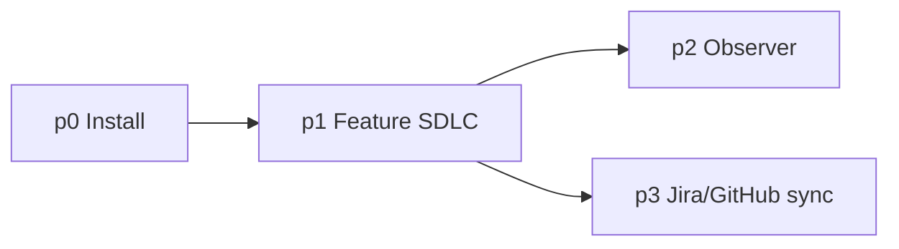

# Architecture — NetApp GSD Recipe

Condensed phase model. Implementation detail: `lld/*.md`. Tasks: [BACKLOG.md](BACKLOG.md).

---

## Principles

- GSD is the **orchestrator**; recipe adds install scaffold, gates, traceability, learnings.
- **p3 traceability runs during p1** — milestone comments, not only at feature end.
- **Settled** = PO + CI green.



---

## Phase map

| Phase | Purpose | LLD |
|-------|---------|-----|
| **p0** | One-time repo bootstrap (templates, `.gsd-recipe/`, skills) | [INSTALL-LLD](lld/INSTALL-LLD.md) |
| **p1** | PRD → plan → build → verify → review → ship | [RUNTIME-LLD](lld/RUNTIME-LLD.md) |
| **p2** | FLY ON THE WALL observer → learnings (deferred) | [OBSERVER-LLD](lld/OBSERVER-LLD.md) |
| **p3** | Jira + GitHub milestone comments, idempotent ledger | [TRACEABILITY-LLD](lld/TRACEABILITY-LLD.md) |

---

## Tracker model

```text
Jira Epic     ← PRD / feature intent
  └── Task    ← one per GSD phase (PLAN.md)
GitHub PR     ← gsd-ship; wave/phase PR comments
```

**Today:** manual `gsd-jira-sync` after milestones.  
**Target:** `sync-reconcile.sh` infers events from `.planning/` mtimes + git.

---

## p0 install (summary)

1. Validate tokens (GitHub + Jira MCP)
2. Scaffold `.templates/`, `.knowledge/`, `.gsd-recipe/`, `code_base_details/` (local-only — gitignored on external targets along with `.planning/`; re-run install per clone)
3. Register `gsd-jira-sync` skill
4. Verify templates + `/gsd-health`

Minimum dirs: `.templates/` `.knowledge/` `.planning/` `.gsd-recipe/` `code_base_details/`

---

## p1 runtime (summary)

1. **Plan** — PRD intake, `gsd-discuss-phase`, `gsd-plan-phase`; 7-section plans ([PLANNING-POLICY](lld/PLANNING-POLICY.md))
2. **DAG** — phase `depends_on` from PLAN frontmatter → `.knowledge/dag/graph.json` (spec: `dag-build.sh`)
3. **Build** — `gsd-execute-phase`; parallel per DAG / `--wave`
4. **Verify** — audits, UAT, `bare_metal` gates (Gate A install, Gate B pre-UAT)
5. **Review** — `gsd-code-review`, `gsd-ship`; settle when PO + CI green

---

## p3 traceability (summary)

- **Jira:** [jira-events.json](reference/harness/recipe/trackers/jira-events.json) + [draft-jira-comment.sh](reference/harness/runners/draft-jira-comment.sh)
- **GitHub:** [github-events.json](reference/harness/recipe/trackers/github-events.json) + [draft-github-pr-comment.sh](reference/harness/runners/draft-github-pr-comment.sh)
- **Templates:** `jira-comments/_comment.template.md`, `github-pr-comments/_comment.template.md` (install copies → `.templates/*-comment.template.md`)

---

## Naming

| Informal | Canonical |
|----------|-----------|
| `.code_base_analysis/` | `.knowledge/` (OKF) |
| `bare_metel.md` | `bare_metal.template.md` |
| Jira comment skeleton | `jira-comments/_comment.template.md` → `.templates/jira-comment.template.md` |
| GitHub PR skeleton | `github-pr-comments/_comment.template.md` → `.templates/github-pr-comment.template.md` |

---

## Built vs target

See [README.md § Built vs spec](README.md#built-vs-spec-100-shipped). LLDs describe **target**; harness reflects **what runs today**.

---

## Recommended extensions (optional)

Per-repo MCP / GSD add-ons — detail in [INSTALL-LLD](lld/INSTALL-LLD.md) and [RUNTIME-LLD](lld/RUNTIME-LLD.md):

- **UAT / debug:** `gsd-browser`, `chrome-devtools-mcp`
- **Code search:** org semantic MCP (e.g. grepai)
- **Knowledge:** `/gsd-map-codebase`, `/gsd-graphify`, `/gsd-ingest-docs`
- **Parallel work:** `gsd-workstreams`, `gsd-execute-phase --wave`

None are required for v1 pilot traceability.
