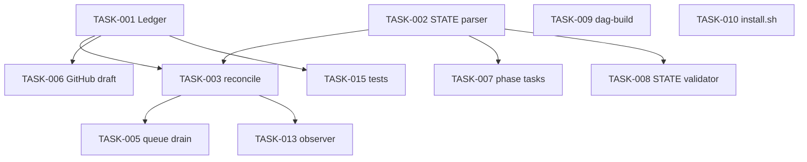

# Implementation backlog

**Status:** 2026-08-19 · Normative detail in `lld/*` and [DATA-CONTRACTS.md](contracts/DATA-CONTRACTS.md). Post-v1 priorities sourced from the [control-group evaluation](CONTROL-GROUP.md).

Implement in **gsd-benchmark** / NetApp-GSD-Recipe: `bench/runners/`, `bench/recipe/`, `.gsd-recipe/`. Copy from [reference/harness/](reference/harness/).

```bash
./bench/runners/draft-jira-comment.sh plan_complete TEST-1 --phase 1
python3 -m pytest bench/tests/ -q   # after TASK-015
```

---

## Priority legend

Priorities are aligned with the [control-group evaluation](CONTROL-GROUP.md) severity bands.

| Priority | Meaning |
|----------|---------|
| **P0** | Blocks first success or actively misleads operators — do first |
| **P1** | High friction or silent failure later — do next |
| **P2** | Polish / jargon / consistency — schedule after P0/P1 |
| **P3** | Parked / deferred / future enhancement |

For **Built** rows the Priority column is the historical importance for the record (its `Status` is Built). For **Planned/Parked** rows it is the targeting priority.

---

## Next up — targeting queue (control-group ordered)

**Shipped this pickup:** TASK-056 (`recipe-start`), TASK-038 (`recipe-help --next` / `--stuck`), TASK-041 (`CLONE.md`).

Sourced from [CONTROL-GROUP.md](CONTROL-GROUP.md) (2026-08-18 persona control-group). All items are **repo-agnostic** — detect only generic artifacts (`docs/PRD.md`, `.planning/*`, `.templates/*`, `.gsd-recipe/config.json`); never hardcode a product repo.

| Order | Task | Priority | Est. | Delivers | Spec |
|-------|------|----------|------|----------|------|
| — | **TASK-056** | P0 · Built | done | `recipe-start` first-run coach | § Wave 5 · [OD-11](DECISIONS.md) · [OD-19](DECISIONS.md) |
| — | **TASK-038** | P0 · Built | done | Situational `recipe-help --next` | § Wave 5 · [OD-11](DECISIONS.md) |
| — | **TASK-040** | P0 · Built | done | Unify install front door (one-page decision tree) | § Wave 5 · [OD-14](DECISIONS.md) |
| — | **TASK-041** | P0 · Built | done | Team clone / reinstall playbook | [CLONE.md](CLONE.md) |
| 5 | **TASK-039** | P1 | 2–3 d | Swappable recipe templates (PRD, comments, SPEC/TDD, bare_metal) | § Wave 5 · [OD-12](DECISIONS.md) · [INSTALL-LLD](lld/INSTALL-LLD.md) |
| 6 | **TASK-042** | P1 | 2–3 d | Light / bugfix path (`--skip-tracker`, optional `recipe-quick`) | § Wave 5 · [OD-15](DECISIONS.md) |
| 7 | **TASK-054** | P1 | 1–2 d | Extend `recipe-onboard`: warn + Yes/No overwrite when planning already exists | § Wave 5 · [OD-17](DECISIONS.md) |
| 8 | **TASK-055** | P1 | 0.5–1 d | Ephemeral test/validation artifacts only under gitignored scratch folder | § Wave 5 · [OD-18](DECISIONS.md) |
| 9 | **TASK-058** | P1 | **1.5–2.5 d** | `recipe-update` — in-place upgrade to latest recipe (no uninstall) | § Wave 5 · [OD-21](DECISIONS.md) · [INSTALL-LLD](lld/INSTALL-LLD.md) |
| 10 | **TASK-059** | P1 | **1.5–2.5 d** | Per-branch snapshot/restore of gitignored PRD + `.planning/` on checkout | § Wave 5 · [OD-22](DECISIONS.md) |
| 11 | **TASK-044** | P1 | 1.5–2.5 d | Install doctor (MCP paste, `recipe_source`, Jira verify collapse) | § Wave 5 · [OD-16](DECISIONS.md) |
| 12 | **TASK-043** | P1 | 0.5 d | `--plan-only` on `recipe-run-phases` | § Wave 5 · [RUNTIME-LLD](lld/RUNTIME-LLD.md) |
| 13 | **TASK-045** | P2 | 0.5 d | Operator cheat-sheet + graphify doc align + `--full` prominence | § Wave 5 |
| 14 | **TASK-036** | P1 | 1–2 d | Build/reconcile `recipe-new-project` catalog status | § Wave 1b |
| 15 | **TASK-046** | P2 | 0.5–1 d | P2 polish cluster (jargon, dual verify, gitignore, sync trio) | § Wave 5 |
| 16 | **TASK-047** | P1 | 0.5–1 d | Claude Code port spike + confirm [OD-13](DECISIONS.md) | § Wave 6 |
| 17 | **TASK-048** | P1 | 3–5 d | Runtime-aware install (`--runtime cursor\|claude\|both`) | § Wave 6 · [OD-13](DECISIONS.md) |
| 18 | **TASK-049 – TASK-051** | P1 | 2–3 d | Claude MCP snippet, runtime-aware capability, skill dual-runtime adapters | § Wave 6 |
| 19 | **TASK-052 – TASK-053** | P2 | 2–4 d | FOTW Claude hook adapter + Claude pilot runbook | § Wave 6 |
| 20 | **TASK-057** | P2 | **1–2 d spike** | DAG parallel conflicts: LLM merge skill spike (not live OT) | § Wave 7 · [OD-20](DECISIONS.md) · after [TASK-009](BACKLOG.md) |

**Estimate notes:** calendar engineer-days for a single implementer familiar with this repo (skill template + installer + docs + focused tests). Not calendar wall-clock with reviews.

---

## Wave 1 — start here

| Order | Task | Delivers | Spec |
|-------|------|----------|------|
| 1 | **TASK-001** | Sync ledger lib | [TRACEABILITY-LLD § Idempotency](lld/TRACEABILITY-LLD.md) |
| 2 | **TASK-002** | STATE.md parser | [DATA-CONTRACTS § STATE](contracts/DATA-CONTRACTS.md#state-md) |
| 3 | **TASK-003** | `sync-reconcile.sh` | [TRACEABILITY-LLD](lld/TRACEABILITY-LLD.md) |
| 4 | **TASK-010** | `install.sh` scaffold | [INSTALL-LLD](lld/INSTALL-LLD.md) |
| 5 | **TASK-006** | GitHub PR draft polish | [TRACEABILITY-LLD](lld/TRACEABILITY-LLD.md) |

**Parallel after TASK-002:** TASK-006, TASK-007, TASK-008, TASK-009.

---

## Dependency graph



---

## Task index

### Wave 1 — traceability

| ID | Priority | Deliverable | Size | Depends | Spec |
|----|----------|-------------|------|---------|------|
| TASK-001 | P0 · Built | `lib/sync-ledger` | S | — | [TRACEABILITY-LLD](lld/TRACEABILITY-LLD.md) — **Built**: `bench/lib/sync-ledger.sh` (idempotency key format, `has`/`append`, dedup-on-repost), covered by `bench/tests/test-sync-ledger.sh`; see [bench/report/sync-ledger-parse-state-tests-integration-report.md](../../bench/report/sync-ledger-parse-state-tests-integration-report.md). |
| TASK-002 | P0 · Built | `parse-state` | S | — | [DATA-CONTRACTS](contracts/DATA-CONTRACTS.md#state-md) — **Built**: `bench/lib/parse-state.sh` — `get-tracker`/`get-phase-issue`/`resolve-issue`/`validate`/`dump` subcommands, epic- vs phase-routed event vocabulary hardcoded per `DATA-CONTRACTS.md` rule 7; see [bench/report/parse-state-integration-report.md](../../bench/report/parse-state-integration-report.md). |
| TASK-003 | P0 · Built | `sync-reconcile.sh` | M | 001, 002 | [TRACEABILITY-LLD](lld/TRACEABILITY-LLD.md) — **Built**: `bench/runners/sync-reconcile.sh` — detects new lifecycle artifacts via `.planning/` mtimes + `git log`, infers `event_id`, resolves the issue key, dedups via `sync-ledger.sh`, drafts the comment, and always queues to `sync-queue.jsonl`; detect+draft+queue only, never posts (draining is TASK-005's job); see [bench/report/sync-reconcile-integration-report.md](../../bench/report/sync-reconcile-integration-report.md). |
| TASK-005 | P1 · Built | `sync-drain-queue.sh` + skill wire-up | S | 003 | [gsd-jira-sync SKILL](reference/skills/gsd-jira-sync/SKILL.md) — **Built**: `bench/runners/sync-drain-queue.sh` — `list`/`mark-done`/`mark-failed` subcommands drain `sync-reconcile.sh`'s queue (re-verify + re-draft + self-heal duplicates), wired into the `gsd-jira-sync` skill's new Drain mode for the real `addCommentToJiraIssue` call; see [bench/report/sync-drain-queue-integration-report.md](../../bench/report/sync-drain-queue-integration-report.md). |
| TASK-015 | P1 · Built | `bench/tests/` ledger + parser | S | 001, 002 | § Testing below — **Built**, formalize only: deliverable already satisfied by `bench/tests/test-sync-ledger.sh` (10 assertions) and `bench/tests/test-parse-state.sh` (20 assertions); one additive record-shape assertion closed a small coverage gap in the former, no gap found in the latter; see [bench/report/sync-ledger-parse-state-tests-integration-report.md](../../bench/report/sync-ledger-parse-state-tests-integration-report.md). |

### Wave 2 — GitHub + Jira automation

| ID | Priority | Deliverable | Size | Depends | Spec |
|----|----------|-------------|------|---------|------|
| TASK-006 | P1 · Built | `draft-github-pr-comment.sh` + templates | M | 001 | [TRACEABILITY-LLD](lld/TRACEABILITY-LLD.md) — **Built**: `bench/runners/draft-github-pr-comment.sh` bundle-copied from `reference/harness/` and polished — fixed a hardcoded `commit=HEAD` idempotency-key bug; stdout only, does not call `gh pr comment` (posting was out of scope until TASK-030); see [bench/report/draft-github-pr-comment-integration-report.md](../../bench/report/draft-github-pr-comment-integration-report.md). |
| TASK-007 | P1 · Built | `create-phase-tasks.sh` | M | 002 | [RUNTIME-LLD](lld/RUNTIME-LLD.md) — **Built**: `bench/runners/create-phase-tasks.sh` `detect`/`mark-done`/`mark-failed` — reads `ROADMAP.md` phases + `STATE.md`'s `## Phase tasks` table (via `parse-state.sh`, extended with a new `add-phase-task` write subcommand), drafts a sub-task per unlinked phase, queues to a purpose-built `.gsd-recipe/phase-tasks-queue.jsonl` (not `sync-queue.jsonl` — schema mismatch, documented in the report); detect+draft+queue only, does not call `createJiraIssue`/`createIssueLink` (agent-mediated, same split as `sync-reconcile.sh`); see [bench/report/create-phase-tasks-integration-report.md](../../bench/report/create-phase-tasks-integration-report.md) |
| TASK-008 | P1 · Built | `state-tracker.sh` validator | S | 002 | [INSTALL-LLD](lld/INSTALL-LLD.md) — **Built**, formalize only: spec absorbed into `parse-state.sh`'s (TASK-002) `validate`/`resolve-issue` subcommands, no separate `state-tracker.sh` created; all 8 `DATA-CONTRACTS.md` validation rules confirmed live rule-by-rule; see [bench/report/state-tracker-validator-integration-report.md](../../bench/report/state-tracker-validator-integration-report.md). |

### Wave 3 — runtime + install

| ID | Priority | Deliverable | Size | Depends | Spec |
|----|----------|-------------|------|---------|------|
| TASK-009 | P3 · Parked | `dag-build.sh` | M | — | [RUNTIME-LLD](lld/RUNTIME-LLD.md) — **Parked**: future enhancement, not required for the current build sequence. Dependency edges (Mermaid graph above, TASK-017's `Depends` column) are left untouched — still accurate, just not picked up now. **Follow-on once unparked:** [TASK-057](BACKLOG.md) LLM merge spike for residual `touches` conflicts ([OD-20](DECISIONS.md)). |
| TASK-010 | P0 · Built | `.gsd-recipe/scripts/install.sh` | L | 008 | [INSTALL-LLD](lld/INSTALL-LLD.md) — **Built**, narrowed scope: local `.templates/`/`.knowledge/`/`config.json` scaffolding + composes `install-observer.sh`/`install-tracker-sync.sh` + a real `gh`-based GitHub check (warn-only) + `--verify`/`--record-jira-check`/`--uninstall`; extended with a `preflight()`/`ensure_prereq()` check→auto-fix→verify→prompt→warn-fallback flow for `python3`/`git`/`node`/`gh`/GSD core/graphify (graphify uniquely also auto-enables `graphify.enabled` in the target's `.planning/config.json` via `gsd-tools config-set`); live Jira scope check and MCP/`agent_skills` injection stay agent-mediated/print-only; see [bench/report/install-scaffold-integration-report.md](../../bench/report/install-scaffold-integration-report.md). |
| TASK-011 | P1 · Built | `capability.json` + config schema | S | 010 | [INSTALL-LLD](lld/INSTALL-LLD.md) — **Built**: `.gsd-recipe/config.schema.json` (validates the real `install.sh`-written `config.json` shape: `tracker`/`traceability`/`observer`) and a new `.gsd-recipe/capability.json` + `.gsd-recipe/capability.schema.json` (static per-repo capability manifest, generated by introspecting `.cursor/skills/`/`skills/`/`ledger.json`), plus `bench/lib/capability-schema.sh` (hand-rolled draft-07-subset validator + `generate-capability`). Composed into `install.sh`'s own flow — see [capability-config-schema-integration-report.md](../../bench/report/capability-config-schema-integration-report.md). |
| TASK-012 | P1 · Built | `recipe-planning-policy` skill | S | — | [PLANNING-POLICY](lld/PLANNING-POLICY.md) — **Built**, ahead of schedule, standalone installer bypassing TASK-010 (also composed into it): folds the per-phase prerequisite-verification workflow, mandatory SPEC.md/TDD.md usage, and `.knowledge/`/graphify context-gathering into an expanded `PLANNING-POLICY.md` plus an injectable `gsd-planner` context file (GSD's `agent_skills` mechanism, staged to `skills/recipe-planning-policy/SKILL.md`, not an invoke-by-name Cursor skill); see [bench/report/recipe-planning-policy-integration-report.md](../../bench/report/recipe-planning-policy-integration-report.md). |

### Wave 4 — observer

| ID | Priority | Deliverable | Size | Depends | Spec |
|----|----------|-------------|------|---------|------|
| TASK-013 | P2 · Built | `fly-on-the-wall` skill | M | 003 | [OBSERVER-LLD](lld/OBSERVER-LLD.md) — **Built**, ahead of schedule, standalone installer bypassing TASK-010: `install-observer.sh` stages the `postToolUse` hook (`fotw-observer-nudge.sh`), `observer-lib.sh`, and the pluggable `fotw-observer-bootstrap` skill trigger; spawns a background `Task` subagent running a real continuous tick loop (classify → append signal/noise → offset-tracked → finalize with a pre-write KB conflict-check); the documented self-driving Cursor Automation/`/loop` mechanism itself is not built; see [bench/report/fotw-observer-install-integration-report.md](../../bench/report/fotw-observer-install-integration-report.md). |
| TASK-014 | P2 · Built | `tracker-sync` generalization | S | 005 | [INSTALL-LLD](lld/INSTALL-LLD.md) — **Built**, narrowed scope: install-time registration + a thin dispatch skill only (`bench/lib/tracker-sync-config.sh`, `.gsd-recipe/scripts/install-tracker-sync.sh`), ahead of schedule via standalone installer bypassing TASK-010; `sync-reconcile.sh`/`sync-drain-queue.sh`/`sync-ledger.sh` stay Jira-literal since there's no second real tracker implementation to branch to yet; see [bench/report/tracker-sync-integration-report.md](../../bench/report/tracker-sync-integration-report.md). |
| TASK-028 | P1 · Built | `gsd-jira-sync` installer | S | 005 | [gsd-jira-sync SKILL](reference/skills/gsd-jira-sync/SKILL.md) — **Built**: closes the install-time staging gap `tracker-sync` (TASK-014) and every `recipe-*` skill that invokes `gsd-jira-sync` "by name" implicitly assumed existed — the skill previously lived only as documentation at `reference/skills/gsd-jira-sync/SKILL.md`, with nothing staging it into `.cursor/skills/gsd-jira-sync/SKILL.md` on a fresh install. Adds `.gsd-recipe/templates/gsd-jira-sync-SKILL.md` (canonical source, adapted path references only — same documented single-event/Drain-mode workflow, unchanged) and `.gsd-recipe/scripts/install-gsd-jira-sync.sh` (standalone, ledger-tracked, mirrors `install-tracker-sync.sh`'s shape; never touches `.gsd-recipe/config.json`'s `tracker` field or `.planning/config.json` — staging only), composed into `install.sh` as a 13th sub-installer. See [bench/report/gsd-jira-sync-installer-integration-report.md](../../bench/report/gsd-jira-sync-installer-integration-report.md). |
| TASK-029 | P2 · Built | `recipe-sync` | S | 003, 005, 028 | [TRACEABILITY-LLD](lld/TRACEABILITY-LLD.md) § "Near-RT reconciler" · [DECISIONS.md](DECISIONS.md) OD-05 — **Built**: one-shot orchestration skill wrapping the detect→queue→drain pipeline into a single invoke-by-name command (`recipe-sync [--dry-run]`). Step 1 runs `sync-reconcile.sh` directly via `Shell` (real script call, `--dry-run` passed through unchanged); step 2 — skipped entirely on `--dry-run` — invokes the `gsd-jira-sync` skill's own Drain mode by name (`gsd-jira-sync --drain`), never reimplementing `sync-drain-queue.sh`'s `list`/`mark-done`/`mark-failed` or the `addCommentToJiraIssue` MCP call itself; step 3 reports a combined queued/posted/failed/skipped-duplicate summary. Per OD-05's "loop-first" framing, this task deliberately implements **no** internal loop, `--interval`/`--watch` flag, cron, or hooks — recurrence is the operator's job (re-invoke it) or Cursor's own generic `/loop` automation, composed externally; the "hooks later" half of OD-05 stays explicitly out of scope. `.gsd-recipe/scripts/install-recipe-sync.sh` (standalone, ledger-tracked, mirrors `install-gsd-jira-sync.sh`'s shape; stages the skill only, never touches `.gsd-recipe/config.json`/`.planning/config.json`/`.gsd-recipe/sync-queue.jsonl`/`.gsd-recipe/sync-ledger.jsonl`), composed into `install.sh` as a 14th sub-installer. See [bench/report/recipe-sync-integration-report.md](../../bench/report/recipe-sync-integration-report.md). |
| TASK-030 | P2 · Built | `recipe-pr-comment` | S | 001, 006 | [TRACEABILITY-LLD](lld/TRACEABILITY-LLD.md) § "GitHub PR events" — **Built**: closes the posting gap `draft-github-pr-comment.sh` (TASK-006) deliberately left open ("Does NOT post to GitHub"). Unlike Jira posting, `gh pr comment` is a real local CLI call, not an MCP call, so the entire draft→idempotency-check→post→ledger pipeline is a single real, standalone, testable script, `bench/runners/post-github-pr-comment.sh` — calls `draft-github-pr-comment.sh` for the body, `sync-ledger.sh` for the idempotency key/dup-check (synthetic `pr-<PR_NUMBER>` issue key when no `--issue` is linked), then the real `gh pr comment --repo <owner/repo> --body-file <tmp>` CLI, appending a `posted` row only after a real `gh` exit `0`. Never emits a stamp (`github-events.json` has no `"stamp"` field at all; the linked Jira side, when present, already owns the canonical KPI stamp for the same milestone). Thin invoke-by-name skill wrapper (`recipe-pr-comment`) delegates entirely to the script (Shell call, no MCP, no Option-B agent-mediated call). `.gsd-recipe/scripts/install-recipe-pr-comment.sh` (standalone, ledger-tracked, stages both the skill and the runner under one `recipe-pr-comment` ledger component — no single `staged_path`, same shape as `recipe-install-verify`'s two-file case), composed into `install.sh` as a 15th sub-installer. See [bench/report/recipe-pr-comment-integration-report.md](../../bench/report/recipe-pr-comment-integration-report.md). |

### Wave 1b — `recipe-*` skills

| ID | Priority | Command | Size | Depends | Spec |
|----|----------|---------|------|---------|------|
| TASK-016 | P0 · Built | `recipe-prd-intake` | S | 010 | [RUNTIME-LLD](lld/RUNTIME-LLD.md) — **Built**, ahead of schedule, standalone installer bypassing TASK-010: `.gsd-recipe/templates/recipe-prd-intake-SKILL.md` + `.gsd-recipe/templates/PRD.template.md`, staged by `.gsd-recipe/scripts/install-recipe-prd-intake.sh`; skill fills the PRD template from a file/pasted text/freeform description (clarifying-question human gate for blanks), writes `docs/PRD.md`, then always invokes `fotw-observer-bootstrap` as its final step; see [bench/report/recipe-prd-intake-integration-report.md](../../bench/report/recipe-prd-intake-integration-report.md). |
| TASK-017 | P0 · Built | `recipe-plan-phase` | S | 009 | [RUNTIME-LLD](lld/RUNTIME-LLD.md) — **Built**, narrowed scope: gate-and-invoke wrapper around native `gsd-plan-phase N` only, with a read-only post-hoc compliance check. DAG topo-sort/cycle-detection and pre-req/post-op gating (§1.c.2.a/b/c) are **not** implemented — parked pending TASK-009 (`dag-build.sh`, not required for v1 per `DECISIONS.md`'s explicit narrowable-now resolution naming this task); `depends_on`/`touches` handling is print-only informational, never reads/writes `.knowledge/dag/*`; the Prerequisites-table check is a soft warn-and-confirm gate, never a fill/fabricate or a hard block. See [bench/report/recipe-plan-phase-integration-report.md](../../bench/report/recipe-plan-phase-integration-report.md). |
| TASK-018 | P1 · Built | `recipe-run-phases` | M | 017, 024 | [RUNTIME-LLD](lld/RUNTIME-LLD.md) — **Built**, narrowed scope: sequential ascending multi-phase loop wrapper around `recipe-plan-phase N`/`recipe-run-phase N`, invoked skill-to-skill (Option B), never raw native `gsd-plan-phase`/`gsd-execute-phase` and never `gsd-autonomous`. No DAG topo-sort/eligibility gating (§1.c.2.a/b/c and the "auto-loop" framing in §2.b itself) — parked pending TASK-009, same narrowed-scope precedent TASK-017/024 already established; `depends_on`/`touches` stay print-only, owned by the two invoked skills. Stops the whole loop immediately on the first phase whose plan step or run step fails; never duplicates Jira sync (already emitted per-phase by the invoked skills); a soft warn-and-confirm gate shows the full range before starting. See [bench/report/recipe-run-phases-integration-report.md](../../bench/report/recipe-run-phases-integration-report.md). |
| TASK-021 | P1 · Built | `recipe-validate-tokens` | S | — | [INSTALL-LLD](lld/INSTALL-LLD.md) — **Built**: standalone, re-invokable credential/scope check formalizing Step 1's token validation and Step 5 checklist item 4 ("re-run step 1 probes"). GitHub check is real and scriptable (`gh auth status`/`gh api user`, warn-only, via its own `--check-github` mode); Jira/Atlassian check is agent-mediated (same architectural constraint as `sync-reconcile.sh`/`install.sh`'s own `--record-jira-check`) — the skill's own instructions tell the invoking agent to call `GetMcpTools`/`CallMcpTool getAccessibleAtlassianResources` directly. Reports PASS/WARN/FAIL per credential with soft remediation suggestions only; never fixes anything, never prints token values, never touches `.gsd-recipe/config.json`/`.planning/config.json`. See [bench/report/recipe-validate-tokens-integration-report.md](../../bench/report/recipe-validate-tokens-integration-report.md). |
| TASK-022 | P1 · Built | `recipe-bootstrap-knowledge` | S | 010 | [INSTALL-LLD](lld/INSTALL-LLD.md) — **Built**: idempotently scaffolds any missing piece of the OKF-shaped `.knowledge/` skeleton (`index.md`, `log.md`, `architecture/`, `dependency-graph/`, `hot-files/`, `risk-register/` — minimal frontmatter placeholders, additive-only, never overwrites), then calls native `/gsd-map-codebase [--fast]`, `/gsd-graphify build`, and `/gsd-ingest-docs --manifest .gsd-recipe/ingest-manifest.yaml` directly in the same turn (Option-B precedent, same reasoning as TASK-017/024); the ingest step alone gracefully warns-and-skips when the manifest doesn't exist yet, never hard-fails, never fabricates one. `gsd-extract-learnings`/`gsd-capture` wrapping (`OBSERVER-LLD.md`) stays explicitly out of scope. Composed into `install.sh` as a 6th sub-installer. See [bench/report/recipe-bootstrap-knowledge-integration-report.md](../../bench/report/recipe-bootstrap-knowledge-integration-report.md). |
| TASK-023 | P1 · Built | `recipe-install-verify` | S | 010 | [INSTALL-LLD](lld/INSTALL-LLD.md) — **Built**, scoped as a thin wrapper: delegates items 5-7 (templates/OKF-index/gitignore) to the existing `install.sh --verify`'s real output rather than re-checking them; runs items 1-3 (`/gsd-health`, `/gsd-health --context`, `/gsd-surface status`) directly via the approved Option-B precedent (`recipe-plan-phase-SKILL.md` § "Why Option B"); item 4 delegates to `recipe-validate-tokens` (TASK-021) if staged, else falls back to a minimal `gh auth status` only — never duplicates TASK-021's fuller probe; items 8-10 (MCP listing, observer-config.json, bare_metal Gate A) are read-only/warn-only checks, with item 10 never fabricating repo-specific bootstrap commands when the template is still generic. Writes an additive `install_verified` marker into `.gsd-recipe/install-report.json` (1-7 gate it, 8-10 never do), reusing that file's existing shape rather than inventing a competing artifact. See [bench/report/recipe-install-verify-integration-report.md](../../bench/report/recipe-install-verify-integration-report.md). |
| TASK-024 | P0 · Built | `recipe-run-phase` | S | 003 | [RUNTIME-LLD](lld/RUNTIME-LLD.md) — **Built**, narrowed scope: gate-and-invoke wrapper around native `gsd-execute-phase N [--wave W]` only. DAG pre-req/post-op gating (§1.c.2.a/b) and `execute_wave` handling are **not** implemented — both stay parked pending TASK-009 (`dag-build.sh`, not required for v1 per `DECISIONS.md`); this task's Prerequisites-table check is a read-only soft warn-and-confirm gate, never a fill/fabricate or a hard block. See [bench/report/recipe-run-phase-integration-report.md](../../bench/report/recipe-run-phase-integration-report.md). |
| TASK-025 | P1 · Built | `recipe-verify-feature` | M | — | [RUNTIME-LLD](lld/RUNTIME-LLD.md) — **Built**, standalone installer composed into `install.sh`: resolves the phase's tracker issue key, chains native `gsd-audit-milestone` (informational gap analysis vs ROADMAP DoD, no stamp, warn-and-skip if inapplicable) → `gsd-audit-uat` (cross-phase UAT, warn-and-skip if inapplicable) → `gsd-verify-work N` (genuinely conversational/interactive — this skill lets its own back-and-forth with the operator run unscripted) directly in the same turn (Option-B precedent, same reasoning as TASK-017/024/022), then syncs `verify_complete` via `gsd-jira-sync` once that conversation concludes (idempotent via `sync-ledger.sh`, fail-open when no tracker issue is linked). Bootstrap Gate A/B, the `gsd-debug` recovery loop, and any benchmark/project-specific grader hook stay explicitly out of scope. See [bench/report/recipe-verify-feature-integration-report.md](../../bench/report/recipe-verify-feature-integration-report.md). |
| TASK-026 | P1 · Built | `recipe-review-ship` | S | — | [RUNTIME-LLD](lld/RUNTIME-LLD.md) — **Built**: gate-and-invoke wrapper calling native `gsd-code-review N` directly, syncing `review_complete` by invoking the `gsd-jira-sync` skill (idempotent via `sync-ledger.sh`, fail-open when no tracker issue is linked, optional `"In Review"` transition), then calling native `gsd-ship N [--draft]` directly and surfacing the resulting PR link. No distinct sync event for the ship/PR-creation step itself — that stays `settled`'s job (`recipe-settle`, TASK-027). Does not re-verify `gsd-ship`'s own "`gsd-verify-work` passed" prerequisite (`recipe-verify-feature`'s, TASK-025, job) and does not bundle `draft-github-pr-comment.sh` (TASK-006) or auto-invoke `gsd-review`/`gsd-ui-review N` (both print-only informational suggestions). See [bench/report/recipe-review-ship-integration-report.md](../../bench/report/recipe-review-ship-integration-report.md). |
| TASK-027 | P1 · Built | `recipe-settle` | S | — | [TRACEABILITY-LLD](lld/TRACEABILITY-LLD.md) — **Built**: quality-floor settle gate formalizing "Settled = PO + CI green" (also `RUNTIME-LLD.md` § 4.c, `FAILURE-MATRIX.md`'s "CI red at settle gate" row). Real, scriptable, testable CI check via its own `--check-ci <owner/repo> <ref>` mode (`gh pr checks`, falling back to `gh api .../check-runs`) — never fabricated. If CI isn't green: hard block, `gsd-jira-sync` is never called, no `settled` event is posted. Only when CI is green AND an explicit, non-skippable, interactive PO-accept y/n question (asked live in the operator's conversation — never a bash `read -p`, never a flag, never auto-answered) is affirmed does it sync `settled` (epic-routed, idempotent via `sync-ledger.sh`, fail-open on a missing tracker epic). Project-specific/benchmark grader hook explicitly parked for v1. See [bench/report/recipe-settle-integration-report.md](../../bench/report/recipe-settle-integration-report.md). |
| TASK-031 | P1 · Built | `recipe-install` | S | 021, 010, 023 | [INSTALL-LLD](lld/INSTALL-LLD.md) — **Built**: the last remaining unbuilt named `recipe-*` skill. Thin, invoke-by-name end-to-end install orchestrator (`.gsd-recipe/scripts/install-recipe-install.sh`, standalone installer composed into `install.sh` as a 16th sub-installer) chaining the three already-separately-invokable pieces INSTALL-LLD.md's flow depends on: Step A invokes `recipe-validate-tokens` (TASK-021) by name, informational only, never blocks; Step B asks a genuine, live, non-skippable human consent question in the operator's own conversation previewing what will be staged — a different, higher-level gate than `install.sh`'s own `--yes`-skippable nested prompt, since this is the one place in the recipe that writes new scaffolding into a possibly-unfamiliar target repo for the first time; Step C runs `install.sh --yes --target <repo>` (TASK-010) directly via `Shell` (INSTALL-LLD.md Steps 2-4, already composing every sub-installer this repo has built); Step D invokes `recipe-install-verify` (TASK-023) by name (Step 5's checklist); Step E reports one combined summary, never fabricating any sub-result. `--uninstall` delegates to `install.sh --uninstall --yes --target <repo>` directly, behind its own equally-explicit live-conversation confirm gate. Never calls `install.sh --record-jira-check` (unrelated feature); never reimplements any check the three invoked pieces already own. See [bench/report/recipe-install-integration-report.md](../../bench/report/recipe-install-integration-report.md). |
| TASK-032 | P2 · Built | `recipe-observe` | S | 013 | [OBSERVER-LLD](lld/OBSERVER-LLD.md) — **Built**: the last remaining unbuilt named `recipe-*` skill (now that TASK-031 landed) — a thin, invoke-by-name front door for the FOTW observer's (TASK-013) operator-facing lifecycle: `status`/`start`/`stop`/`enable`/`disable`. Adds four new `bench/lib/observer-lib.sh` subcommands (`status` — read-only, always-exit-0 multi-line report; `enable`/`disable` — atomic `"enabled"` JSON toggle, mktemp+mv, fails closed on a missing config; `request-stop` — idempotently creates the stop-sentinel file `session_end_triggers.explicit_stop`/`fotw-observer-task-prompt.md` already watched for before this task, previously only human-`touch`-able). `start` delegates entirely to `fotw-observer-bootstrap` by name (Option B skill-to-skill dispatch, zero new spawn logic). `stop` is a graceful-finalize signal only — it cannot forcibly kill an already-running background `Task` subagent (no such capability exists in this recipe or in Cursor's own `Task` tool); the skill's own doc calls this out as a dedicated, non-buried section. `.gsd-recipe/scripts/install-recipe-observe.sh` (standalone, ledger-tracked, mirrors `install-tracker-sync.sh`'s shape; stages the skill only, never touches `.gsd-recipe/observer-config.json`/`.gsd-recipe/lib/observer-lib.sh`/`install-observer.sh` — those remain exclusively `install-observer.sh`'s job), composed into `install.sh` as a 17th sub-installer. See [bench/report/recipe-observe-integration-report.md](../../bench/report/recipe-observe-integration-report.md). |
| TASK-033 | P1 · Built | `recipe-create-epic` | S | 002, 016 | [DATA-CONTRACTS](contracts/DATA-CONTRACTS.md#state-md) — **Built**: closes the "PRD → Epic" gap — an invoke-by-name skill that reads `docs/PRD.md` (fails closed with an actionable message if absent, pointing at `recipe-prd-intake`), resolves the Jira project (optional `--project`, else a live, non-skippable `getVisibleJiraProjects` question — never defaults to "the first one returned") and the Epic issue type (optional `--issue-type`, else `getJiraProjectIssueTypesMetadata` with a safe case-insensitive "Epic" default, falling back to a live question only if genuinely absent), drafts the summary/description via the new `bench/runners/draft-jira-epic.sh` (real script; H1 heading -> summary with a 255-char Jira-limit truncation, the real `.templates/PRD.template.md` `## ` sections -> description, in file order), asks a soft yes/no confirm gate previewing everything before creating anything remote, calls `createJiraIssue` via the Atlassian MCP, links the result into `.planning/STATE.md`'s `## Tracker` section via `bench/lib/parse-state.sh`'s new `init-tracker` write subcommand (idempotent no-op on an identical relink; fails closed on a genuine conflict without `--force`; `--force` overwrites cleanly, preserving `## Phase tasks`), and syncs `intake_started` by invoking the `gsd-jira-sync` skill by name — never calling `addCommentToJiraIssue`/`transitionJiraIssue` directly itself. `.gsd-recipe/scripts/install-recipe-create-epic.sh` (standalone, ledger-tracked, stages both the skill and the runner under one `recipe-create-epic` ledger component — no single `staged_path`, same shape as `recipe-pr-comment`'s two-file case; also adds a small additive `--verify` mode beyond the mirrored shape), composed into `install.sh` as an 18th sub-installer. See [bench/report/recipe-create-epic-integration-report.md](../../bench/report/recipe-create-epic-integration-report.md). |
| TASK-034 | P1 · Built | `recipe-create-phase-tasks` | S | 007 | [RUNTIME-LLD](lld/RUNTIME-LLD.md) § "1.d Tracker epic + tasks [C]" — **Built**: closes the exact gap TASK-007's own row leaves open in writing ("does not call `createJiraIssue`/`createIssueLink`"). Extends `create-phase-tasks.sh` with a new `list` subcommand (mirrors `sync-drain-queue.sh list`'s self-heal-then-return-work pattern, sourced from `parse-state.sh dump` rather than a ledger check, since phase-task rows have no ledger entry) that re-verifies every `queued`/`failed` row against `STATE.md`'s `## Phase tasks` table first, self-healing anything already linked out-of-band before returning the genuinely-pending work. Thin invoke-by-name skill wrapper (`recipe-create-phase-tasks`) chains `detect` (once) → `list` → a once-per-batch `getJiraProjectIssueTypesMetadata` issue-type resolution (prefers Task, then Sub-task) → a soft confirm gate → per-row `createJiraIssue` + link (`parent` field for Sub-task, else `createIssueLink`) → `mark-done`/`mark-failed`. `.gsd-recipe/scripts/install-recipe-create-phase-tasks.sh` (standalone, ledger-tracked, stages the skill only — `create-phase-tasks.sh` already lives in place, extended not copied), composed into `install.sh` as a 19th sub-installer. See [bench/report/recipe-create-phase-tasks-integration-report.md](../../bench/report/recipe-create-phase-tasks-integration-report.md). |
| TASK-035 | P2 · Built | `recipe-run-phases` extension | S | 017, 024, 025, 026, 027 | [RUNTIME-LLD](lld/RUNTIME-LLD.md) §2.b — **Built** (in-place extension of TASK-018's own skill, no new installer/component): `<start>`/`<end>` are now optional — omitting both auto-detects `[start, end]` from every `## Phase N — Title` heading in `.planning/ROADMAP.md` (same heading grammar `create-phase-tasks.sh` already uses), with backward-compatible argument-error handling when only one is given. A new optional `--full` flag additionally chains `recipe-verify-feature N` → `recipe-review-ship N` → `recipe-settle N` per phase, after `recipe-run-phase N` completes and before advancing — any of the three failing/declining stops the whole range loop immediately, same as a plan-step/run-step failure. `--full` is strictly opt-in; omitting it is byte-for-byte identical to pre-TASK-035 behavior. See [bench/report/recipe-run-phases-auto-range-integration-report.md](../../bench/report/recipe-run-phases-auto-range-integration-report.md). |
| TASK-037 | P0 · Built | `recipe-onboard` | S | 016, 033, 034 | [BACKLOG](BACKLOG.md) — **Built**: single onboarding orchestrator closing the "no single on-ramp" gap — one read-only reconnaissance pass determines which of `docs/PRD.md` / `.planning/ROADMAP.md` / a linked Jira Epic / per-phase Jira sub-tasks already exist, then shows exactly one soft preview-then-confirm gate for the whole four-step chain (never four nested ones) before invoking, in order, whichever of `recipe-prd-intake` → `recipe-new-project` → `recipe-create-epic` → `recipe-create-phase-tasks` are actually missing their artifact, skipping any step whose artifact is already present. Stops the whole chain immediately on the first step that fails or is declined; never re-implements any invoked skill's own logic, never fabricates a sub-result, and never duplicates any invoked skill's own Jira sync (`intake_started` stays exclusively `recipe-create-epic`'s own event, exactly as `recipe-new-project`'s own design already establishes). Step 2 (project bootstrap) is the one exception to "always invoke by name": if `recipe-new-project` (TASK-036) isn't staged on a given install, it falls back to calling native `gsd-new-project` directly instead of failing closed on a sibling skill that may not exist yet — the only native-call fallback in this skill's whole chain. `recipe-discuss-phase`/`recipe-complete-milestone` were evaluated and explicitly deferred, not folded into any of the four steps. `.gsd-recipe/scripts/install-recipe-onboard.sh` (standalone, ledger-tracked, single-file skill staging, same shape as `install-recipe-run-phases.sh`), composed into `install.sh` as a sub-installer (path variable, header comment, `install()`/`uninstall()` wiring, `verify()`'s `ledger_has_component` check). |

### Wave 5 — operator UX + template customization (planned)

Sourced from the [control-group evaluation](CONTROL-GROUP.md). All repo-agnostic — detect generic artifacts only, never a product repo.

| ID | Priority | Deliverable | Size | Depends | Spec |
|----|----------|-------------|------|---------|------|
| TASK-056 | P0 · Built | `recipe-start` first-run coach | M | existing `recipe-help`, 037 | **Built.** Skill + `install-recipe-start.sh` composed into `install.sh`; resolver `bench/lib/recipe-next.sh` (also staged as `.gsd-recipe/scripts/recipe-next.sh`). Read-only recommend; Yes/No to invoke. Tests: `bench/tests/test-recipe-next.sh`, `test-install-recipe-start.sh`. Post-install first-run front door: after recipe install, operators invoke `recipe-start` and get direction on how to onboard a PRD and what to run next. Does **not** invent a parallel workflow (OD-19). Maps states → one next skill (no PRD → how to call `recipe-onboard` with file/paste/description; PRD only → onboard; onboarded → bootstrap → plan → run → verify → ship → settle). When planning already exists and a new PRD is implied, point at TASK-054 overwrite gate once shipped (until then: print manual re-init hint). Repo-agnostic. See [OD-11](DECISIONS.md), [OD-19](DECISIONS.md). |
| TASK-060 | P0 · Built | `recipe-status` snapshot + next | S | 056 | **Built.** Read-only skill + installer composed into `install.sh`; `bench/lib/recipe-status.sh` is staged as `.gsd-recipe/scripts/recipe-status.sh`. Prints generic status (branch, PRD/ROADMAP/Epic/phase keys, PLAN/SUMMARY, install Jira check, sync queue and last ledger event), then delegates next-step selection to TASK-056's `recipe-next.sh`. It never invokes another skill; use `recipe-start` for the optional run gate. Tests: `bench/tests/test-recipe-status.sh`, `test-install-recipe-status.sh`. Repo-agnostic. |
| TASK-038 | P0 · Built | `recipe-help` situational next / stuck playbook | S | 056 | **Built.** `recipe-help --next` runs the TASK-056 resolver; `--stuck` is a short FAQ; default tour stays catalog plus one “Stuck?” line. Must not mutate the repo. See [DECISIONS OD-11](DECISIONS.md), [CONTROL-GROUP P0#3](CONTROL-GROUP.md). |
| TASK-040 | P0 · Built | Unify install front door (one-page decision tree) | M | 010, 031, 023 | **Built** — root README now provides the canonical "install into any repo" decision tree. First install = `install-recipe-to-target.sh` from a recipe source clone; `recipe-install` = re-run/restage after skills exist; `recipe-install-verify` and `recipe-install --uninstall` cover installed targets. `install.sh` is documented as the delegated implementation detail, and `bin/recipe install` as a compatibility-only thin runner alias. Post-install points to `recipe-start` (`recipe-status` optional). No runtime changes. See [DECISIONS OD-14](DECISIONS.md), [CLONE.md](CLONE.md), and [INSTALL-LLD](lld/INSTALL-LLD.md). |
| TASK-041 | P0 · Built | Team clone / reinstall playbook | S | 010 | **Built** — [CLONE.md](CLONE.md): re-run `install-recipe-to-target.sh` per clone vs optional chore PR to share `.planning/`. Linked from AGENTS.md / README. See [DECISIONS locked scaffold](DECISIONS.md), [CONTROL-GROUP P0#2](CONTROL-GROUP.md). |
| TASK-039 | P1 · Planned | Swappable recipe templates | M | 010, 016 | **Planned** — **repo-agnostic** ability for a target (or org overlay) to replace default recipe templates without forking the recipe. In-scope templates at minimum: `PRD.template.md`, `jira-comment.template.md` / `{TRACKER}-comment.template.md`, `github-pr-comment.template.md` / `{VCS_PROVIDER}-pr-comment.template.md`, plus `SPEC.template.md`, `TDD.template.md`, `bare_metal.template.md` when present. Design sketch: (1) install continues to stage defaults into `.templates/` when absent; (2) operator- or org-supplied overrides win — never clobber an existing customized file on re-install (already partially true for some templates — make this the explicit contract for all); (3) optional config keys under `.gsd-recipe/config.json` (e.g. `templates.prd`, `templates.jira_comment`, …) or a documented overlay directory that `recipe-prd-intake`, `draft-jira-comment.sh`, `draft-github-pr-comment.sh`, and epic drafting resolve through one shared resolver (prefer `recipe-paths.sh` or a small `resolve-template.sh`); (4) validation: required section headings / placeholders still present so intake and comment drafts don't silently degrade; (5) `recipe-help --brief templates` documents how to swap. Also ships a **light PRD template** variant for the bugfix arm (pairs with TASK-042). Out of scope: inventing per-product template content inside the recipe repo; shipping AgentStudio-specific PRDs. Wire into [INSTALL-LLD](lld/INSTALL-LLD.md) § templates + [DATA-CONTRACTS](contracts/DATA-CONTRACTS.md) if a config schema field is added. See [DECISIONS OD-12](DECISIONS.md), [CONTROL-GROUP P0#4](CONTROL-GROUP.md). |
| TASK-042 | P1 · Planned | Light / bugfix path (`--skip-tracker`, optional `recipe-quick`) | M | 037, 039 | **Planned** — Bugfixer persona: a one-line UI fix carries the same Epic → PRD → phase → 7-section PLAN weight as a full feature, and `gsd-quick` sits outside recipe traceability. Add a low-ceremony path: (a) `recipe-onboard --skip-tracker` (or a light onboard mode) that skips Epic + per-phase Jira sub-task creation for small work; (b) optionally a `recipe-quick` wrapper that brings native `gsd-quick` into recipe traceability (minimal Jira milestone wiring, `.planning/quick/`); (c) pair with the light PRD template from TASK-039 and a relaxed planning-policy note for UI-only phases. Full path stays default; light path is explicit opt-in. Repo-agnostic. See [DECISIONS OD-15](DECISIONS.md), [CONTROL-GROUP P0#4](CONTROL-GROUP.md), [`03-bugfixer.md`](../../bench/report/recipe-control-group-persona-audits/03-bugfixer.md). |
| TASK-043 | P1 · Planned | `--plan-only` on `recipe-run-phases` | S | 018 | **Planned** — Feature-dev persona: `recipe-run-phases` always executes after planning; there is no way to plan an entire range up front for review, then execute later. Add a strictly opt-in `--plan-only` flag that runs `recipe-plan-phase N` for each phase in `[start, end]` and stops before any `recipe-run-phase` — no execution, no `--full` chaining. Omitting the flag is byte-for-byte identical to today. Repo-agnostic. See [CONTROL-GROUP P0#5](CONTROL-GROUP.md), [RUNTIME-LLD](lld/RUNTIME-LLD.md) §2.b. |
| TASK-044 | P1 · Planned | Install doctor (MCP paste, `recipe_source`, Jira verify collapse) | M | 010, 023, 021 | **Planned** — collapse the P1 install-friction cluster (Platform, PM) into one re-runnable doctor: (a) fix the MCP/`agent_skills` paste snippet — remove phantom skill paths, add a paste checklist so injection actually lands; (b) make `recipe_source` refresh on reinstall / honor an env override instead of write-once-stale-across-machines; (c) merge the three-step Jira verify (`pending` → agent → `--record-jira-check`) into `recipe-install-verify` so INSTALL-VERIFIED is reachable in one pass. Extends `recipe-install-verify`/`install.sh --verify` rather than inventing a competing artifact. See [DECISIONS OD-16](DECISIONS.md), [CONTROL-GROUP P1](CONTROL-GROUP.md), [`05-platform.md`](../../bench/report/recipe-control-group-persona-audits/05-platform.md). |
| TASK-045 | P2 · Planned | Operator cheat-sheet + graphify doc align + `--full` prominence | S | 038 | **Planned** — the P2 docs cluster: (a) one cheat-sheet visual disambiguating `recipe-plan-phase` vs `recipe-run-phase` vs `recipe-run-phases` (AND/OR confusion — New-dev, Feature-dev); (b) make `recipe-run-phases --full` prominent so operators know verify/review/settle only run when opted in; (c) align the graphify story — `recipe-bootstrap-knowledge` "always run graphify" vs README warn-skip soft-fail. Docs only; may reference the TASK-038 coach. See [CONTROL-GROUP P1/P2](CONTROL-GROUP.md). |
| TASK-046 | P2 · Planned | P2 polish cluster | S | — | **Planned** — batch the remaining P2 polish: AgentStudio/TASK-ID jargon in onboarding docs; dual verify paths (`install.sh --verify` vs `recipe-install-verify`) reconciled/cross-linked; gitignore verify list missing `graphify-out/`; AGENTS.md "don't invoke GSD" vs recipe Option-B wrappers clarified; sync trio (`recipe-sync` / `tracker-sync` / `gsd-jira-sync`) roles made explicit. Docs/consistency only. See [CONTROL-GROUP P2](CONTROL-GROUP.md). |
| TASK-054 | P1 · Planned | Extend `recipe-onboard` with overwrite Yes/No gate | M | 036, 037, 033, 034 | **Planned** — **no new command.** Extend existing `recipe-onboard` so a second PRD / new initiative in an already-onboarded repo is handled in-place. Today onboard **silently skips** when `docs/PRD.md`, `.planning/ROADMAP.md`, Epic, or phase-task keys exist — so `recipe-onboard docs/other-PRD.md` leaves the old planning cycle. Change: when any of those artifacts exist **and** the operator supplied a PRD source (or intake would otherwise be a no-op overwrite), fire one soft **warn + Yes/No** question summarizing what would be replaced (current PRD title / ROADMAP phases / Epic key → proposed source). **Yes** → overwrite path: (1) optionally archive `.planning/` → `.planning-archive/<run_id>/`; (2) write/overwrite `docs/PRD.md` from the new source; (3) re-init via `recipe-new-project` / `gsd-new-project`; (4) create or **`--force` relink** Epic + phase tasks for the new ROADMAP; (5) print summary (old epic → new epic). **No** → keep current artifacts unchanged; print a short suggestion: continue delivery on the existing ROADMAP (`recipe-bootstrap-knowledge` → `recipe-plan-phase N` → …), or settle/finish the current Epic before starting a new initiative. First-init (no existing artifacts) stays unchanged — no overwrite gate. Out of scope: mutating git remotes or open PRs. Repo-agnostic. Update `.gsd-recipe/templates/recipe-onboard-SKILL.md`, `docs/RECIPE-ONBOARD.md`, and tests. See [DECISIONS OD-17](DECISIONS.md), [CONTROL-GROUP](CONTROL-GROUP.md). |
| TASK-055 | P1 · Planned | Ephemeral test/validation artifacts → gitignored scratch folder | S | 010, 012 | **Planned** — policy + scaffold: any files generated **only** for testing, smoke checks, screenshots-of-proof, dump fixtures, or validity (not product feature/bug deliverables) must always be written under a **pre-created folder that install already puts in `.gitignore`**. Default path: `.gsd-recipe/scratch/` (create at install with a `.gitkeep` + short `README.md` stating purpose; parent `.gsd-recipe/` is already gitignored on external targets — also add an explicit `.gsd-recipe/scratch/` line if useful for clarity on self-install). Wire into: (1) `install.sh` mkdir + gitignore ensure; (2) [PLANNING-POLICY](lld/PLANNING-POLICY.md) mandatory note for agents; (3) soft reminders in `recipe-plan-phase` / `recipe-run-phase` / `recipe-verify-feature` skill templates; (4) AGENTS.md / RECIPE-ONBOARD one-liner. **In scope:** agent-created temp scripts, curl dumps, mock payloads, local evidence for UAT. **Out of scope:** real project unit/integration tests and fixtures that ship with the feature (those stay in the repo's normal `test/` / `__tests__` / etc. layout). Repo-agnostic. See [DECISIONS OD-18](DECISIONS.md), [INSTALL-LLD](lld/INSTALL-LLD.md) § gitignore. |
| TASK-058 | P1 · Planned | `recipe-update` in-place upgrade | M | 010, 031 | **Planned** — internal command so operators can **upgrade the recipe without uninstall/reinstall**. Mirrors native `gsd-update`. **Est. 1.5–2.5 engineer-days.** Behavior: (1) resolve source via `.gsd-recipe/config.json` `recipe_source` (or env override; fail closed with “re-run install-recipe-to-target from a clone of the recipe repo” if missing — pairs with TASK-044); (2) fetch latest (git pull/fetch in that source clone, or clone a documented default remote if source is a git URL — never invent a product-repo URL); (3) show a short changelog / commit range vs last staged ledger or recorded `recipe_version`; (4) Yes/No confirm; (5) restage via `install.sh --yes --target <this-repo>` **without** `--uninstall` — overwrite recipe-owned skills/scripts, do **not** wipe `.planning/`, `STATE.md`, Epic/phase keys, `.knowledge/` human files, or customized `.templates/` (OD-12); (6) refresh `recipe_source` + record version; (7) print “restart Agent chat / invoke `recipe-start`”. Optional `--check` (report only), `--dry-run`. **Not** a substitute for first install (chicken-and-egg: `recipe-update` is itself a staged skill). Distinct from TASK-041 (fresh clone has no skills). See [OD-21](DECISIONS.md), [INSTALL-LLD § Removal / upgrade](lld/INSTALL-LLD.md). |
| TASK-059 | P1 · Planned | Per-branch workspace swap on `git checkout` | M | 010 | **Planned** — **Est. 1.5–2.5 d.** Local **git `post-checkout` hook** (not an HTTP webhook): when `HEAD` moves to another branch, snapshot gitignored recipe files for the *previous* branch and restore the snapshot for the *new* branch. Default payload: `.planning/` + `docs/PRD.md` (plus `docs/PRD-*.md` only if gitignored/untracked). Store under `.gsd-recipe/workspaces/<sanitized-branch>/`. If no snapshot for the new branch, do **not** copy the previous branch’s planning onto it. Skip file-only checkouts (`post-checkout` 3rd arg = 0). Skip if `RECIPE_WORKSPACE_SWAP=0`. Install opt-in via `core.hooksPath=.gsd-recipe/hooks` or `.git/hooks/post-checkout`. Also restage missing `.gitignore` installer lines on branch checkout. Optional `recipe-workspace save\|restore\|status`. **Capture matrix:** hook runs for **Cursor UI and Cursor/Claude agents only when they invoke the Git CLI** (`git checkout` / `git switch` / `git worktree add`). If Cursor’s branch picker uses libgit2 and skips hooks, ship a **Cursor `postToolUse` fallback** that matches those command names and runs the same snapshot/restore script. **Unbiased tester (required AC):** a *separate* subagent (not the implementer) must (1) create two throwaway branches with distinct PRD/planning snapshots, (2) `git switch` via Shell as an “agent”, (3) assert restore, (4) `RECIPE_WORKSPACE_SWAP=0` is a no-op, (5) file-only checkout does not swap; UI picker is a manual operator check recorded in the integration report. **Out of scope:** GitHub webhooks, swapping committed files, sharing snapshots across clones. See [OD-22](DECISIONS.md). |

**Also reconcile (Wave 1b carry-over):**

| ID | Priority | Deliverable | Size | Depends | Spec |
|----|----------|-------------|------|---------|------|
| TASK-036 | P1 · Planned | `recipe-new-project` (build or reconcile catalog status) | S | 010 | **Planned** — repo-bootstrap wrapper around native `gsd-new-project`/`gsd-import`; catalogued (`bench/lib/capability-schema.sh`) and referenced by `recipe-onboard`'s fallback path, but not yet built (no `.gsd-recipe/templates/recipe-new-project-SKILL.md`/installer). Control-group (New-dev, Feature-dev) flagged the "catalog says planned vs onboard uses it" trust gap. Either build the skill or reconcile the catalog status so the two agree. See [CONTROL-GROUP P1](CONTROL-GROUP.md). |

---

### Wave 6 — Claude Code dual-runtime port (planned)

From companion research; decision [OD-13](DECISIONS.md), overview in [CONTROL-GROUP § Claude Code port](CONTROL-GROUP.md). Core harness (`.planning/`, `bench/runners/*`, `bench/lib/*`, Jira/GitHub sync, ledger, STATE) is already runtime-agnostic and GSD core already supports `--claude`; only the Cursor-shaped surface (`.cursor/skills/`, `Task` tool, `/loop`, `hooks.json`) is adapted.

| ID | Priority | Deliverable | Size | Depends | Spec |
|----|----------|-------------|------|---------|------|
| TASK-047 | P1 · Planned | Claude Code port spike + confirm OD-13 | S | — | **Planned** — timeboxed spike: install the recipe against a Claude Code target, confirm which pieces run unchanged (core harness, GSD `--claude`) and which need adapters (`.claude/skills/` vs `.cursor/skills/`, `.claude/settings.json` MCP, no `Task`/`/loop`/`hooks.json`). Output: confirmed OD-13 scope + phase split (Phase 1 MVP = install + MCP snippet + GSD detection; Phase 3 = observer). No production code. See [DECISIONS OD-13](DECISIONS.md). |
| TASK-048 | P1 · Planned | Runtime-aware install (`--runtime cursor\|claude\|both`) | L | 047, 010 | **Planned** — parameterize `install.sh` and the ~20 sub-installers on a single `--runtime` switch resolving skill-dir/MCP/hook paths from one recipe source (add a small `recipe-runtime.sh` resolver; Cursor path is today's default, Claude adds `.claude/skills/`). `both` stages both surfaces. No content fork — same skill templates, different staged destinations. Expect ~21 sub-installers to become runtime-aware. See [DECISIONS OD-13](DECISIONS.md), [INSTALL-LLD](lld/INSTALL-LLD.md). |
| TASK-049 | P1 · Planned | Claude MCP `.claude/settings.json` snippet | S | 048 | **Planned** — Claude Code equivalent of the Cursor MCP/`agent_skills` injection: a staged `.claude/settings.json` MCP snippet + paste checklist (Atlassian + any GitHub MCP), mirroring the Cursor snippet the install doctor (TASK-044) fixes. Print-only/agent-mediated where the runtime can't script it, same architectural constraint as the Cursor side. See [DECISIONS OD-13](DECISIONS.md). |
| TASK-050 | P1 · Planned | Runtime-aware `capability.json` | S | 048, 011 | **Planned** — extend `capability.json`/`capability.schema.json` + `bench/lib/capability-schema.sh generate-capability` to record the active runtime (`cursor`/`claude`/`both`) and introspect the correct skills dir (`.claude/skills/` vs `.cursor/skills/`) so downstream checks and `recipe-install-verify` report the right surface. See [DECISIONS OD-13](DECISIONS.md), [DATA-CONTRACTS](contracts/DATA-CONTRACTS.md). |
| TASK-051 | P1 · Planned | Skill template dual-runtime adapters | M | 048 | **Planned** — make the shared `.gsd-recipe/templates/*-SKILL.md` sources render/stage correctly for both runtimes (frontmatter/path references that differ between Cursor invoke-by-name and Claude skill invocation), through one adapter layer rather than duplicated templates. Skills that hard-depend on Cursor-only mechanisms (observer via `Task`/`/loop`) are flagged for Phase 3. See [DECISIONS OD-13](DECISIONS.md). |
| TASK-052 | P2 · Planned | FOTW observer Claude hook adapter (Phase 3) | M | 013, 051 | **Planned** — deferred observer port: adapt the FOTW observer's Cursor-specific `postToolUse` `hooks.json` + `Task` subagent tick loop to Claude Code's `.claude/settings.json` hooks and its own background mechanism (or document the gap where no 1:1 equivalent exists). Explicitly out of the MVP; scheduled after the Phase 1 install path is proven. See [DECISIONS OD-13](DECISIONS.md), [OBSERVER-LLD](lld/OBSERVER-LLD.md). |
| TASK-053 | P2 · Planned | Claude Code pilot runbook | S | 048, 049 | **Planned** — a one-page operator runbook for running the recipe end-to-end under Claude Code (install `--runtime claude`, paste MCP snippet, confirm GSD `--claude`, run the plan → run → verify → ship → settle loop), noting the observer caveat. Mirrors the Cursor front-door/team-clone docs (TASK-040/041). See [DECISIONS OD-13](DECISIONS.md). |

---

### Wave 7 — DAG parallel production experiments (planned / after Tier-1)

Practical spikes once [TASK-009](BACKLOG.md) (`dag-build.sh`) is unparked. Not in the S5 first-run critical path.

| ID | Priority | Deliverable | Size | Depends | Spec |
|----|----------|-------------|------|---------|------|
| TASK-057 | P2 · Planned | LLM merge skill spike for DAG / workstream conflicts | S | 009 | **Planned — practical experiment.** Test whether a gated skill can resolve same-file conflicts from parallel DAG phases / workstreams the way an improved GitHub merge does (LLM + PLAN intent), vs pursuing Google Docs–style live OT/CRDT (explicitly out of scope per OD-20). **Est. 1–2 engineer-days for the spike** (not a full production skill). Spike protocol: (1) two worktrees/branches from phases marked `parallel_candidate` that intentionally overlap one `touches` file near the same lines; (2) run normal git merge/rebase to surface conflict markers; (3) invoke a prototype `recipe-resolve-conflict` (or agent playbook) with base + ours + theirs + both `PLAN.md` intents; (4) Yes/No gate before writing; (5) run existing tests; (6) record outcomes in `bench/report/` (auto-resolve success vs semantic failure vs human needed). **Success criteria for graduating to a real skill:** textual conflicts with disjoint intent resolve cleanly ≥ majority of fixtures; overlapping API/contract conflicts always require human confirm; no silent overwrite of uncommitted work. **Out of scope:** real-time multi-agent co-editing of one buffer; replacing Tier-1 `touches` serialize recommendations. See [OD-20](DECISIONS.md), [RUNTIME-LLD §1.c.2.c](lld/RUNTIME-LLD.md). |

---

## Testing

| Layer | What | Where |
|-------|------|-------|
| Unit | STATE parser, ledger keys | `bench/tests/` + fixtures |
| Dry-run | Draft scripts, `sync-reconcile.sh --dry-run` | No live Jira/GitHub in CI |
| Acceptance | P-1–P-3 (see [README](README.md#verification-p-1p-3)) | Manual / sandbox |

**Fixtures (proposed):** `bench/tests/fixtures/state-tracker-valid.md`, `sync-ledger-sample.jsonl`, `planning-phase-complete/.planning/...`

**CI:** `pytest bench/tests/`, draft scripts on fixtures, STATE validator (TASK-008), reconcile dry-run (TASK-003).  
**Manual only:** live `gsd-jira-sync`, `gh pr comment`.  
**Unbiased tester subagent:** required for operator-facing Wave 5+ skills — see Pick-up below.

| Check | Tasks |
|-------|-------|
| STATE parse | TASK-002, TASK-008 |
| Ledger / idempotency | TASK-001, TASK-015 |
| Reconcile dry-run | TASK-003 |
| GitHub PR draft | TASK-006 |
| Unbiased operator walkthrough | TASK-056 onward (each pickup) |

---

## Pick-up / done

**Cadence:** one TASK at a time from the targeting queue. Do not start the next until Done below is true.

### Per-task loop

1. **Pick** the next **Planned** row in [§ Next up](#next-up--targeting-queue-control-group-ordered) (starts at **TASK-056**).
2. **Branch** `task/TASK-0NN-<short-slug>` from `main`. Read **only** that task’s spec + linked OD/LLD.
3. **Implement** in gsd-benchmark (skills, installers, docs, `bench/tests/` as specified).
4. **Self-check** — implementer runs scripted tests (`pytest`, `bench/tests/test-install.sh`, skill `--verify` if any).
5. **Unbiased tester subagent** (required for operator-facing tasks) — spawn a *fresh* agent with **no implementer transcript**. Prompt it as a New-dev / Platform persona: give only the public skill/docs, a throwaway target clone, and the task’s AC checklist. It must try to break skip-paths, wrong flags, and “happy path only” assumptions. It writes `bench/report/task-TASK-0NN-unbiased-test.md` (pass/fail per AC, surprises, token/time if relevant). Implementer may fix and re-run the tester **once**; remaining fails stay in the report.
6. **Done:** AC in spec met; tester report attached; update [README § Built vs spec](README.md#built-vs-spec-100-shipped) if operator-facing; mark the BACKLOG row **Built**.

### Unbiased tester rules

- **Different agent instance** from the author; do not paste the implementation plan — only SKILL.md, README snippets, and AC.
- Act as an operator who has never seen the PR.
- Prefer **recipe-sandbox** as `--target` ([SANDBOX.md](SANDBOX.md); default `~/Projects/recipe-sandbox`). Recreate with `./bench/runners/setup-recipe-sandbox.sh --reset`. Never AgentStudio production branches unless the operator asks.
- For TASK-059: tester **must** drive `git switch` via Shell (agent-equivalent). Cursor UI branch picker is **operator-manual**, noted in the report.
- Fail the task if the tester cannot complete the happy path from docs alone.

### First five pickups (do in this order)

| # | Task | Why this order | Tester persona |
|---|------|----------------|----------------|
| 1 | **TASK-056** `recipe-start` | First-run coach; unblocks everything else | New-dev |
| 2 | **TASK-038** `recipe-help --next` | Reuses 056 resolver | New-dev (stuck) |
| 3 | **TASK-040** install front door | Docs + chicken-egg | New-dev + Platform |
| 4 | **TASK-041** team clone playbook | Docs only | Platform |
| 5 | **TASK-039** swappable templates | Then P1 cluster | Bugfixer / Feature-dev |

Then continue the targeting queue (042, 054, 055, 058, 059, …). **TASK-059** tester extra: two branches, agent `git switch`, opt-out env, file-only checkout.

---

## Sprints

| Sprint | Tasks | Outcome |
|--------|-------|---------|
| S1 | 001, 002, 015 | Foundation + tests |
| S2 | 003, 005, 016, 017 | Reconcile + wrappers |
| S3 | 006, 007, 008 | GitHub + Jira UX |
| S4 | 009, 010, 011, 012 | DAG + install |
| Post-pilot | 013, 014 | Observer |
| S5 (planned) | **056**, 038, 040, 041 | Control-group P0: **`recipe-start` first** + help `--next` + install front door + team clone playbook |
| S5b (planned) | 039, 042, 054, 055, 058, 059, 043, 044 | Control-group P1 + update/workspace: templates, light path, onboard overwrite, scratch, `recipe-update`, per-branch workspace swap, `--plan-only`, install doctor |
| S5c (planned) | 045, 046, 036 | Control-group P2 polish + `recipe-new-project` reconcile |
| S6 (planned) | 047, 048, 049, 050, 051 | Claude Code dual-runtime install MVP (OD-13) |
| S6b (planned) | 052, 053 | Claude observer adapter + pilot runbook |
| S7 (planned, after TASK-009) | 057 | DAG conflict LLM-merge spike (OD-20) — practical test |
