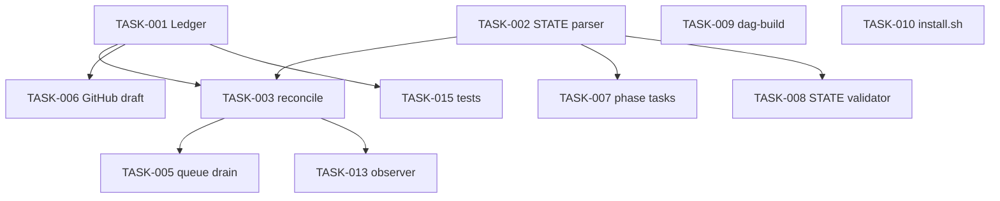

# Implementation backlog

**Status:** 2026-07-03 · Normative detail in `lld/*` and [DATA-CONTRACTS.md](contracts/DATA-CONTRACTS.md).

Implement in **gsd-benchmark**: `bench/runners/`, `bench/recipe/`. Copy from [reference/harness/](reference/harness/).

```bash
./bench/runners/draft-jira-comment.sh plan_complete TEST-1 --phase 1
python3 -m pytest bench/tests/ -q   # after TASK-015
```

---

## Wave 1 — start here

| Order | Task | Delivers | Spec |
|-------|------|----------|------|
| 1 | **TASK-001** | Sync ledger lib | [TRACEABILITY-LLD § Idempotency](lld/TRACEABILITY-LLD.md) |
| 2 | **TASK-002** | STATE.md parser | [DATA-CONTRACTS § STATE](contracts/DATA-CONTRACTS.md#state-md) |
| 3 | **TASK-003** | `sync-reconcile.sh` | [TRACEABILITY-LLD](lld/TRACEABILITY-LLD.md) |
| 4 | **TASK-010** | `install.sh` scaffold | [INSTALL-LLD](lld/INSTALL-LLD.md) |
| 5 | **TASK-006** | GitHub PR draft polish | [TRACEABILITY-LLD](lld/TRACEABILITY-LLD.md) |

**Parallel after TASK-002:** TASK-006, TASK-007, TASK-008, TASK-009.

---

## Dependency graph



---

## Task index

### Wave 1 — traceability

| ID | Deliverable | Size | Depends | Spec |
|----|-------------|------|---------|------|
| TASK-001 | `lib/sync-ledger` | S | — | [TRACEABILITY-LLD](lld/TRACEABILITY-LLD.md) — **Built**: `bench/lib/sync-ledger.sh` (idempotency key format, `has`/`append`, dedup-on-repost), covered by `bench/tests/test-sync-ledger.sh`; see [bench/report/sync-ledger-parse-state-tests-integration-report.md](../../bench/report/sync-ledger-parse-state-tests-integration-report.md). |
| TASK-002 | `parse-state` | S | — | [DATA-CONTRACTS](contracts/DATA-CONTRACTS.md#state-md) — **Built**: `bench/lib/parse-state.sh` — `get-tracker`/`get-phase-issue`/`resolve-issue`/`validate`/`dump` subcommands, epic- vs phase-routed event vocabulary hardcoded per `DATA-CONTRACTS.md` rule 7; see [bench/report/parse-state-integration-report.md](../../bench/report/parse-state-integration-report.md). |
| TASK-003 | `sync-reconcile.sh` | M | 001, 002 | [TRACEABILITY-LLD](lld/TRACEABILITY-LLD.md) — **Built**: `bench/runners/sync-reconcile.sh` — detects new lifecycle artifacts via `.planning/` mtimes + `git log`, infers `event_id`, resolves the issue key, dedups via `sync-ledger.sh`, drafts the comment, and always queues to `sync-queue.jsonl`; detect+draft+queue only, never posts (draining is TASK-005's job); see [bench/report/sync-reconcile-integration-report.md](../../bench/report/sync-reconcile-integration-report.md). |
| TASK-005 | `sync-drain-queue.sh` + skill wire-up | S | 003 | [gsd-jira-sync SKILL](reference/skills/gsd-jira-sync/SKILL.md) — **Built**: `bench/runners/sync-drain-queue.sh` — `list`/`mark-done`/`mark-failed` subcommands drain `sync-reconcile.sh`'s queue (re-verify + re-draft + self-heal duplicates), wired into the `gsd-jira-sync` skill's new Drain mode for the real `addCommentToJiraIssue` call; see [bench/report/sync-drain-queue-integration-report.md](../../bench/report/sync-drain-queue-integration-report.md). |
| TASK-015 | `bench/tests/` ledger + parser | S | 001, 002 | § Testing below — **Built**, formalize only: deliverable already satisfied by `bench/tests/test-sync-ledger.sh` (10 assertions) and `bench/tests/test-parse-state.sh` (20 assertions); one additive record-shape assertion closed a small coverage gap in the former, no gap found in the latter; see [bench/report/sync-ledger-parse-state-tests-integration-report.md](../../bench/report/sync-ledger-parse-state-tests-integration-report.md). |

### Wave 2 — GitHub + Jira automation

| ID | Deliverable | Size | Depends | Spec |
|----|-------------|------|---------|------|
| TASK-006 | `draft-github-pr-comment.sh` + templates | M | 001 | [TRACEABILITY-LLD](lld/TRACEABILITY-LLD.md) — **Built**: `bench/runners/draft-github-pr-comment.sh` bundle-copied from `reference/harness/` and polished — fixed a hardcoded `commit=HEAD` idempotency-key bug; stdout only, does not call `gh pr comment` (posting was out of scope until TASK-030); see [bench/report/draft-github-pr-comment-integration-report.md](../../bench/report/draft-github-pr-comment-integration-report.md). |
| TASK-007 | `create-phase-tasks.sh` | M | 002 | [RUNTIME-LLD](lld/RUNTIME-LLD.md) — **Built**: `bench/runners/create-phase-tasks.sh` `detect`/`mark-done`/`mark-failed` — reads `ROADMAP.md` phases + `STATE.md`'s `## Phase tasks` table (via `parse-state.sh`, extended with a new `add-phase-task` write subcommand), drafts a sub-task per unlinked phase, queues to a purpose-built `.gsd-recipe/phase-tasks-queue.jsonl` (not `sync-queue.jsonl` — schema mismatch, documented in the report); detect+draft+queue only, does not call `createJiraIssue`/`createIssueLink` (agent-mediated, same split as `sync-reconcile.sh`); see [bench/report/create-phase-tasks-integration-report.md](../../bench/report/create-phase-tasks-integration-report.md) |
| TASK-008 | `state-tracker.sh` validator | S | 002 | [INSTALL-LLD](lld/INSTALL-LLD.md) — **Built**, formalize only: spec absorbed into `parse-state.sh`'s (TASK-002) `validate`/`resolve-issue` subcommands, no separate `state-tracker.sh` created; all 8 `DATA-CONTRACTS.md` validation rules confirmed live rule-by-rule; see [bench/report/state-tracker-validator-integration-report.md](../../bench/report/state-tracker-validator-integration-report.md). |

### Wave 3 — runtime + install

| ID | Deliverable | Size | Depends | Spec |
|----|-------------|------|---------|------|
| TASK-009 | `dag-build.sh` | M | — | [RUNTIME-LLD](lld/RUNTIME-LLD.md) — **Parked**: future enhancement, not required for the current build sequence. Dependency edges (Mermaid graph above, TASK-017's `Depends` column) are left untouched — still accurate, just not picked up now. |
| TASK-010 | `.gsd-recipe/scripts/install.sh` | L | 008 | [INSTALL-LLD](lld/INSTALL-LLD.md) — **Built**, narrowed scope: local `.templates/`/`.knowledge/`/`config.json` scaffolding + composes `install-observer.sh`/`install-tracker-sync.sh` + a real `gh`-based GitHub check (warn-only) + `--verify`/`--record-jira-check`/`--uninstall`; extended with a `preflight()`/`ensure_prereq()` check→auto-fix→verify→prompt→warn-fallback flow for `python3`/`git`/`node`/`gh`/GSD core/graphify (graphify uniquely also auto-enables `graphify.enabled` in the target's `.planning/config.json` via `gsd-tools config-set`); live Jira scope check and MCP/`agent_skills` injection stay agent-mediated/print-only; see [bench/report/install-scaffold-integration-report.md](../../bench/report/install-scaffold-integration-report.md). |
| TASK-011 | `capability.json` + config schema | S | 010 | [INSTALL-LLD](lld/INSTALL-LLD.md) — **Built**: `.gsd-recipe/config.schema.json` (validates the real `install.sh`-written `config.json` shape: `tracker`/`traceability`/`observer`) and a new `.gsd-recipe/capability.json` + `.gsd-recipe/capability.schema.json` (static per-repo capability manifest, generated by introspecting `.cursor/skills/`/`skills/`/`ledger.json`), plus `bench/lib/capability-schema.sh` (hand-rolled draft-07-subset validator + `generate-capability`). Composed into `install.sh`'s own flow — see [capability-config-schema-integration-report.md](../../bench/report/capability-config-schema-integration-report.md). |
| TASK-012 | `recipe-planning-policy` skill | S | — | [PLANNING-POLICY](lld/PLANNING-POLICY.md) — **Built**, ahead of schedule, standalone installer bypassing TASK-010 (also composed into it): folds the per-phase prerequisite-verification workflow, mandatory SPEC.md/TDD.md usage, and `.knowledge/`/graphify context-gathering into an expanded `PLANNING-POLICY.md` plus an injectable `gsd-planner` context file (GSD's `agent_skills` mechanism, staged to `skills/recipe-planning-policy/SKILL.md`, not an invoke-by-name Cursor skill); see [bench/report/recipe-planning-policy-integration-report.md](../../bench/report/recipe-planning-policy-integration-report.md). |

### Wave 4 — observer

| ID | Deliverable | Size | Depends | Spec |
|----|-------------|------|---------|------|
| TASK-013 | `fly-on-the-wall` skill | M | 003 | [OBSERVER-LLD](lld/OBSERVER-LLD.md) — **Built**, ahead of schedule, standalone installer bypassing TASK-010: `install-observer.sh` stages the `postToolUse` hook (`fotw-observer-nudge.sh`), `observer-lib.sh`, and the pluggable `fotw-observer-bootstrap` skill trigger; spawns a background `Task` subagent running a real continuous tick loop (classify → append signal/noise → offset-tracked → finalize with a pre-write KB conflict-check); the documented self-driving Cursor Automation/`/loop` mechanism itself is not built; see [bench/report/fotw-observer-install-integration-report.md](../../bench/report/fotw-observer-install-integration-report.md). |
| TASK-014 | `tracker-sync` generalization | S | 005 | [INSTALL-LLD](lld/INSTALL-LLD.md) — **Built**, narrowed scope: install-time registration + a thin dispatch skill only (`bench/lib/tracker-sync-config.sh`, `.gsd-recipe/scripts/install-tracker-sync.sh`), ahead of schedule via standalone installer bypassing TASK-010; `sync-reconcile.sh`/`sync-drain-queue.sh`/`sync-ledger.sh` stay Jira-literal since there's no second real tracker implementation to branch to yet; see [bench/report/tracker-sync-integration-report.md](../../bench/report/tracker-sync-integration-report.md). |
| TASK-028 | `gsd-jira-sync` installer | S | 005 | [gsd-jira-sync SKILL](reference/skills/gsd-jira-sync/SKILL.md) — **Built**: closes the install-time staging gap `tracker-sync` (TASK-014) and every `recipe-*` skill that invokes `gsd-jira-sync` "by name" implicitly assumed existed — the skill previously lived only as documentation at `reference/skills/gsd-jira-sync/SKILL.md`, with nothing staging it into `.cursor/skills/gsd-jira-sync/SKILL.md` on a fresh install. Adds `.gsd-recipe/templates/gsd-jira-sync-SKILL.md` (canonical source, adapted path references only — same documented single-event/Drain-mode workflow, unchanged) and `.gsd-recipe/scripts/install-gsd-jira-sync.sh` (standalone, ledger-tracked, mirrors `install-tracker-sync.sh`'s shape; never touches `.gsd-recipe/config.json`'s `tracker` field or `.planning/config.json` — staging only), composed into `install.sh` as a 13th sub-installer. See [bench/report/gsd-jira-sync-installer-integration-report.md](../../bench/report/gsd-jira-sync-installer-integration-report.md). |
| TASK-029 | `recipe-sync` | S | 003, 005, 028 | [TRACEABILITY-LLD](lld/TRACEABILITY-LLD.md) § "Near-RT reconciler" · [DECISIONS.md](DECISIONS.md) OD-05 — **Built**: one-shot orchestration skill wrapping the detect→queue→drain pipeline into a single invoke-by-name command (`recipe-sync [--dry-run]`). Step 1 runs `sync-reconcile.sh` directly via `Shell` (real script call, `--dry-run` passed through unchanged); step 2 — skipped entirely on `--dry-run` — invokes the `gsd-jira-sync` skill's own Drain mode by name (`gsd-jira-sync --drain`), never reimplementing `sync-drain-queue.sh`'s `list`/`mark-done`/`mark-failed` or the `addCommentToJiraIssue` MCP call itself; step 3 reports a combined queued/posted/failed/skipped-duplicate summary. Per OD-05's "loop-first" framing, this task deliberately implements **no** internal loop, `--interval`/`--watch` flag, cron, or hooks — recurrence is the operator's job (re-invoke it) or Cursor's own generic `/loop` automation, composed externally; the "hooks later" half of OD-05 stays explicitly out of scope. `.gsd-recipe/scripts/install-recipe-sync.sh` (standalone, ledger-tracked, mirrors `install-gsd-jira-sync.sh`'s shape; stages the skill only, never touches `.gsd-recipe/config.json`/`.planning/config.json`/`.gsd-recipe/sync-queue.jsonl`/`.gsd-recipe/sync-ledger.jsonl`), composed into `install.sh` as a 14th sub-installer. See [bench/report/recipe-sync-integration-report.md](../../bench/report/recipe-sync-integration-report.md). |
| TASK-030 | `recipe-pr-comment` | S | 001, 006 | [TRACEABILITY-LLD](lld/TRACEABILITY-LLD.md) § "GitHub PR events" — **Built**: closes the posting gap `draft-github-pr-comment.sh` (TASK-006) deliberately left open ("Does NOT post to GitHub"). Unlike Jira posting, `gh pr comment` is a real local CLI call, not an MCP call, so the entire draft→idempotency-check→post→ledger pipeline is a single real, standalone, testable script, `bench/runners/post-github-pr-comment.sh` — calls `draft-github-pr-comment.sh` for the body, `sync-ledger.sh` for the idempotency key/dup-check (synthetic `pr-<PR_NUMBER>` issue key when no `--issue` is linked), then the real `gh pr comment --repo <owner/repo> --body-file <tmp>` CLI, appending a `posted` row only after a real `gh` exit `0`. Never emits a stamp (`github-events.json` has no `"stamp"` field at all; the linked Jira side, when present, already owns the canonical KPI stamp for the same milestone). Thin invoke-by-name skill wrapper (`recipe-pr-comment`) delegates entirely to the script (Shell call, no MCP, no Option-B agent-mediated call). `.gsd-recipe/scripts/install-recipe-pr-comment.sh` (standalone, ledger-tracked, stages both the skill and the runner under one `recipe-pr-comment` ledger component — no single `staged_path`, same shape as `recipe-install-verify`'s two-file case), composed into `install.sh` as a 15th sub-installer. See [bench/report/recipe-pr-comment-integration-report.md](../../bench/report/recipe-pr-comment-integration-report.md). |

### Wave 1b — `recipe-*` skills

| ID | Command | Size | Depends | Spec |
|----|---------|------|---------|------|
| TASK-016 | `recipe-prd-intake` | S | 010 | [RUNTIME-LLD](lld/RUNTIME-LLD.md) — **Built**, ahead of schedule, standalone installer bypassing TASK-010: `.gsd-recipe/templates/recipe-prd-intake-SKILL.md` + `.gsd-recipe/templates/PRD.template.md`, staged by `.gsd-recipe/scripts/install-recipe-prd-intake.sh`; skill fills the PRD template from a file/pasted text/freeform description (clarifying-question human gate for blanks), writes `docs/PRD.md`, then always invokes `fotw-observer-bootstrap` as its final step; see [bench/report/recipe-prd-intake-integration-report.md](../../bench/report/recipe-prd-intake-integration-report.md). |
| TASK-017 | `recipe-plan-phase` | S | 009 | [RUNTIME-LLD](lld/RUNTIME-LLD.md) — **Built**, narrowed scope: gate-and-invoke wrapper around native `gsd-plan-phase N` only, with a read-only post-hoc compliance check. DAG topo-sort/cycle-detection and pre-req/post-op gating (§1.c.2.a/b/c) are **not** implemented — parked pending TASK-009 (`dag-build.sh`, not required for v1 per `DECISIONS.md`'s explicit narrowable-now resolution naming this task); `depends_on`/`touches` handling is print-only informational, never reads/writes `.knowledge/dag/*`; the Prerequisites-table check is a soft warn-and-confirm gate, never a fill/fabricate or a hard block. See [bench/report/recipe-plan-phase-integration-report.md](../../bench/report/recipe-plan-phase-integration-report.md). |
| TASK-018 | `recipe-run-phases` | M | 017, 024 | [RUNTIME-LLD](lld/RUNTIME-LLD.md) — **Built**, narrowed scope: sequential ascending multi-phase loop wrapper around `recipe-plan-phase N`/`recipe-run-phase N`, invoked skill-to-skill (Option B), never raw native `gsd-plan-phase`/`gsd-execute-phase` and never `gsd-autonomous`. No DAG topo-sort/eligibility gating (§1.c.2.a/b/c and the "auto-loop" framing in §2.b itself) — parked pending TASK-009, same narrowed-scope precedent TASK-017/024 already established; `depends_on`/`touches` stay print-only, owned by the two invoked skills. Stops the whole loop immediately on the first phase whose plan step or run step fails; never duplicates Jira sync (already emitted per-phase by the invoked skills); a soft warn-and-confirm gate shows the full range before starting. See [bench/report/recipe-run-phases-integration-report.md](../../bench/report/recipe-run-phases-integration-report.md). |
| TASK-021 | `recipe-validate-tokens` | S | — | [INSTALL-LLD](lld/INSTALL-LLD.md) — **Built**: standalone, re-invokable credential/scope check formalizing Step 1's token validation and Step 5 checklist item 4 ("re-run step 1 probes"). GitHub check is real and scriptable (`gh auth status`/`gh api user`, warn-only, via its own `--check-github` mode); Jira/Atlassian check is agent-mediated (same architectural constraint as `sync-reconcile.sh`/`install.sh`'s own `--record-jira-check`) — the skill's own instructions tell the invoking agent to call `GetMcpTools`/`CallMcpTool getAccessibleAtlassianResources` directly. Reports PASS/WARN/FAIL per credential with soft remediation suggestions only; never fixes anything, never prints token values, never touches `.gsd-recipe/config.json`/`.planning/config.json`. See [bench/report/recipe-validate-tokens-integration-report.md](../../bench/report/recipe-validate-tokens-integration-report.md). |
| TASK-022 | `recipe-bootstrap-knowledge` | S | 010 | [INSTALL-LLD](lld/INSTALL-LLD.md) — **Built**: idempotently scaffolds any missing piece of the OKF-shaped `.knowledge/` skeleton (`index.md`, `log.md`, `architecture/`, `dependency-graph/`, `hot-files/`, `risk-register/` — minimal frontmatter placeholders, additive-only, never overwrites), then calls native `/gsd-map-codebase [--fast]`, `/gsd-graphify build`, and `/gsd-ingest-docs --manifest .gsd-recipe/ingest-manifest.yaml` directly in the same turn (Option-B precedent, same reasoning as TASK-017/024); the ingest step alone gracefully warns-and-skips when the manifest doesn't exist yet, never hard-fails, never fabricates one. `gsd-extract-learnings`/`gsd-capture` wrapping (`OBSERVER-LLD.md`) stays explicitly out of scope. Composed into `install.sh` as a 6th sub-installer. See [bench/report/recipe-bootstrap-knowledge-integration-report.md](../../bench/report/recipe-bootstrap-knowledge-integration-report.md). |
| TASK-023 | `recipe-install-verify` | S | 010 | [INSTALL-LLD](lld/INSTALL-LLD.md) — **Built**, scoped as a thin wrapper: delegates items 5-7 (templates/OKF-index/gitignore) to the existing `install.sh --verify`'s real output rather than re-checking them; runs items 1-3 (`/gsd-health`, `/gsd-health --context`, `/gsd-surface status`) directly via the approved Option-B precedent (`recipe-plan-phase-SKILL.md` § "Why Option B"); item 4 delegates to `recipe-validate-tokens` (TASK-021) if staged, else falls back to a minimal `gh auth status` only — never duplicates TASK-021's fuller probe; items 8-10 (MCP listing, observer-config.json, bare_metal Gate A) are read-only/warn-only checks, with item 10 never fabricating repo-specific bootstrap commands when the template is still generic. Writes an additive `install_verified` marker into `.gsd-recipe/install-report.json` (1-7 gate it, 8-10 never do), reusing that file's existing shape rather than inventing a competing artifact. See [bench/report/recipe-install-verify-integration-report.md](../../bench/report/recipe-install-verify-integration-report.md). |
| TASK-024 | `recipe-run-phase` | S | 003 | [RUNTIME-LLD](lld/RUNTIME-LLD.md) — **Built**, narrowed scope: gate-and-invoke wrapper around native `gsd-execute-phase N [--wave W]` only. DAG pre-req/post-op gating (§1.c.2.a/b) and `execute_wave` handling are **not** implemented — both stay parked pending TASK-009 (`dag-build.sh`, not required for v1 per `DECISIONS.md`); this task's Prerequisites-table check is a read-only soft warn-and-confirm gate, never a fill/fabricate or a hard block. See [bench/report/recipe-run-phase-integration-report.md](../../bench/report/recipe-run-phase-integration-report.md). |
| TASK-025 | `recipe-verify-feature` | M | — | [RUNTIME-LLD](lld/RUNTIME-LLD.md) — **Built**, standalone installer composed into `install.sh`: resolves the phase's tracker issue key, chains native `gsd-audit-milestone` (informational gap analysis vs ROADMAP DoD, no stamp, warn-and-skip if inapplicable) → `gsd-audit-uat` (cross-phase UAT, warn-and-skip if inapplicable) → `gsd-verify-work N` (genuinely conversational/interactive — this skill lets its own back-and-forth with the operator run unscripted) directly in the same turn (Option-B precedent, same reasoning as TASK-017/024/022), then syncs `verify_complete` via `gsd-jira-sync` once that conversation concludes (idempotent via `sync-ledger.sh`, fail-open when no tracker issue is linked). Bootstrap Gate A/B, the `gsd-debug` recovery loop, and any benchmark/project-specific grader hook stay explicitly out of scope. See [bench/report/recipe-verify-feature-integration-report.md](../../bench/report/recipe-verify-feature-integration-report.md). |
| TASK-026 | `recipe-review-ship` | S | — | [RUNTIME-LLD](lld/RUNTIME-LLD.md) — **Built**: gate-and-invoke wrapper calling native `gsd-code-review N` directly, syncing `review_complete` by invoking the `gsd-jira-sync` skill (idempotent via `sync-ledger.sh`, fail-open when no tracker issue is linked, optional `"In Review"` transition), then calling native `gsd-ship N [--draft]` directly and surfacing the resulting PR link. No distinct sync event for the ship/PR-creation step itself — that stays `settled`'s job (`recipe-settle`, TASK-027). Does not re-verify `gsd-ship`'s own "`gsd-verify-work` passed" prerequisite (`recipe-verify-feature`'s, TASK-025, job) and does not bundle `draft-github-pr-comment.sh` (TASK-006) or auto-invoke `gsd-review`/`gsd-ui-review N` (both print-only informational suggestions). See [bench/report/recipe-review-ship-integration-report.md](../../bench/report/recipe-review-ship-integration-report.md). |
| TASK-027 | `recipe-settle` | S | — | [TRACEABILITY-LLD](lld/TRACEABILITY-LLD.md) — **Built**: quality-floor settle gate formalizing "Settled = PO + CI green" (also `RUNTIME-LLD.md` § 4.c, `FAILURE-MATRIX.md`'s "CI red at settle gate" row). Real, scriptable, testable CI check via its own `--check-ci <owner/repo> <ref>` mode (`gh pr checks`, falling back to `gh api .../check-runs`) — never fabricated. If CI isn't green: hard block, `gsd-jira-sync` is never called, no `settled` event is posted. Only when CI is green AND an explicit, non-skippable, interactive PO-accept y/n question (asked live in the operator's conversation — never a bash `read -p`, never a flag, never auto-answered) is affirmed does it sync `settled` (epic-routed, idempotent via `sync-ledger.sh`, fail-open on a missing tracker epic). Project-specific/benchmark grader hook explicitly parked for v1. See [bench/report/recipe-settle-integration-report.md](../../bench/report/recipe-settle-integration-report.md). |
| TASK-031 | `recipe-install` | S | 021, 010, 023 | [INSTALL-LLD](lld/INSTALL-LLD.md) — **Built**: the last remaining unbuilt named `recipe-*` skill. Thin, invoke-by-name end-to-end install orchestrator (`.gsd-recipe/scripts/install-recipe-install.sh`, standalone installer composed into `install.sh` as a 16th sub-installer) chaining the three already-separately-invokable pieces INSTALL-LLD.md's flow depends on: Step A invokes `recipe-validate-tokens` (TASK-021) by name, informational only, never blocks; Step B asks a genuine, live, non-skippable human consent question in the operator's own conversation previewing what will be staged — a different, higher-level gate than `install.sh`'s own `--yes`-skippable nested prompt, since this is the one place in the recipe that writes new scaffolding into a possibly-unfamiliar target repo for the first time; Step C runs `install.sh --yes --target <repo>` (TASK-010) directly via `Shell` (INSTALL-LLD.md Steps 2-4, already composing every sub-installer this repo has built); Step D invokes `recipe-install-verify` (TASK-023) by name (Step 5's checklist); Step E reports one combined summary, never fabricating any sub-result. `--uninstall` delegates to `install.sh --uninstall --yes --target <repo>` directly, behind its own equally-explicit live-conversation confirm gate. Never calls `install.sh --record-jira-check` (unrelated feature); never reimplements any check the three invoked pieces already own. See [bench/report/recipe-install-integration-report.md](../../bench/report/recipe-install-integration-report.md). |
| TASK-032 | `recipe-observe` | S | 013 | [OBSERVER-LLD](lld/OBSERVER-LLD.md) — **Built**: the last remaining unbuilt named `recipe-*` skill (now that TASK-031 landed) — a thin, invoke-by-name front door for the FOTW observer's (TASK-013) operator-facing lifecycle: `status`/`start`/`stop`/`enable`/`disable`. Adds four new `bench/lib/observer-lib.sh` subcommands (`status` — read-only, always-exit-0 multi-line report; `enable`/`disable` — atomic `"enabled"` JSON toggle, mktemp+mv, fails closed on a missing config; `request-stop` — idempotently creates the stop-sentinel file `session_end_triggers.explicit_stop`/`fotw-observer-task-prompt.md` already watched for before this task, previously only human-`touch`-able). `start` delegates entirely to `fotw-observer-bootstrap` by name (Option B skill-to-skill dispatch, zero new spawn logic). `stop` is a graceful-finalize signal only — it cannot forcibly kill an already-running background `Task` subagent (no such capability exists in this recipe or in Cursor's own `Task` tool); the skill's own doc calls this out as a dedicated, non-buried section. `.gsd-recipe/scripts/install-recipe-observe.sh` (standalone, ledger-tracked, mirrors `install-tracker-sync.sh`'s shape; stages the skill only, never touches `.gsd-recipe/observer-config.json`/`.gsd-recipe/lib/observer-lib.sh`/`install-observer.sh` — those remain exclusively `install-observer.sh`'s job), composed into `install.sh` as a 17th sub-installer. See [bench/report/recipe-observe-integration-report.md](../../bench/report/recipe-observe-integration-report.md). |
| TASK-033 | `recipe-create-epic` | S | 002, 016 | [DATA-CONTRACTS](contracts/DATA-CONTRACTS.md#state-md) — **Built**: closes the "PRD → Epic" gap — an invoke-by-name skill that reads `docs/PRD.md` (fails closed with an actionable message if absent, pointing at `recipe-prd-intake`), resolves the Jira project (optional `--project`, else a live, non-skippable `getVisibleJiraProjects` question — never defaults to "the first one returned") and the Epic issue type (optional `--issue-type`, else `getJiraProjectIssueTypesMetadata` with a safe case-insensitive "Epic" default, falling back to a live question only if genuinely absent), drafts the summary/description via the new `bench/runners/draft-jira-epic.sh` (real script; H1 heading -> summary with a 255-char Jira-limit truncation, the real `.templates/PRD.template.md` `## ` sections -> description, in file order), asks a soft yes/no confirm gate previewing everything before creating anything remote, calls `createJiraIssue` via the Atlassian MCP, links the result into `.planning/STATE.md`'s `## Tracker` section via `bench/lib/parse-state.sh`'s new `init-tracker` write subcommand (idempotent no-op on an identical relink; fails closed on a genuine conflict without `--force`; `--force` overwrites cleanly, preserving `## Phase tasks`), and syncs `intake_started` by invoking the `gsd-jira-sync` skill by name — never calling `addCommentToJiraIssue`/`transitionJiraIssue` directly itself. `.gsd-recipe/scripts/install-recipe-create-epic.sh` (standalone, ledger-tracked, stages both the skill and the runner under one `recipe-create-epic` ledger component — no single `staged_path`, same shape as `recipe-pr-comment`'s two-file case; also adds a small additive `--verify` mode beyond the mirrored shape), composed into `install.sh` as an 18th sub-installer. See [bench/report/recipe-create-epic-integration-report.md](../../bench/report/recipe-create-epic-integration-report.md). |
| TASK-034 | `recipe-create-phase-tasks` | S | 007 | [RUNTIME-LLD](lld/RUNTIME-LLD.md) § "1.d Tracker epic + tasks [C]" — **Built**: closes the exact gap TASK-007's own row leaves open in writing ("does not call `createJiraIssue`/`createIssueLink`"). Extends `create-phase-tasks.sh` with a new `list` subcommand (mirrors `sync-drain-queue.sh list`'s self-heal-then-return-work pattern, sourced from `parse-state.sh dump` rather than a ledger check, since phase-task rows have no ledger entry) that re-verifies every `queued`/`failed` row against `STATE.md`'s `## Phase tasks` table first, self-healing anything already linked out-of-band before returning the genuinely-pending work. Thin invoke-by-name skill wrapper (`recipe-create-phase-tasks`) chains `detect` (once) → `list` → a once-per-batch `getJiraProjectIssueTypesMetadata` issue-type resolution (prefers Task, then Sub-task) → a soft confirm gate → per-row `createJiraIssue` + link (`parent` field for Sub-task, else `createIssueLink`) → `mark-done`/`mark-failed`. `.gsd-recipe/scripts/install-recipe-create-phase-tasks.sh` (standalone, ledger-tracked, stages the skill only — `create-phase-tasks.sh` already lives in place, extended not copied), composed into `install.sh` as a 19th sub-installer. See [bench/report/recipe-create-phase-tasks-integration-report.md](../../bench/report/recipe-create-phase-tasks-integration-report.md). |
| TASK-035 | `recipe-run-phases` extension | S | 017, 024, 025, 026, 027 | [RUNTIME-LLD](lld/RUNTIME-LLD.md) §2.b — **Built** (in-place extension of TASK-018's own skill, no new installer/component): `<start>`/`<end>` are now optional — omitting both auto-detects `[start, end]` from every `## Phase N — Title` heading in `.planning/ROADMAP.md` (same heading grammar `create-phase-tasks.sh` already uses), with backward-compatible argument-error handling when only one is given. A new optional `--full` flag additionally chains `recipe-verify-feature N` → `recipe-review-ship N` → `recipe-settle N` per phase, after `recipe-run-phase N` completes and before advancing — any of the three failing/declining stops the whole range loop immediately, same as a plan-step/run-step failure. `--full` is strictly opt-in; omitting it is byte-for-byte identical to pre-TASK-035 behavior. See [bench/report/recipe-run-phases-auto-range-integration-report.md](../../bench/report/recipe-run-phases-auto-range-integration-report.md). |
| TASK-037 | `recipe-onboard` | S | 016, 033, 034 | [BACKLOG](BACKLOG.md) — **Built**: single onboarding orchestrator closing the "no single on-ramp" gap — one read-only reconnaissance pass determines which of `docs/PRD.md` / `.planning/ROADMAP.md` / a linked Jira Epic / per-phase Jira sub-tasks already exist, then shows exactly one soft preview-then-confirm gate for the whole four-step chain (never four nested ones) before invoking, in order, whichever of `recipe-prd-intake` → `recipe-new-project` → `recipe-create-epic` → `recipe-create-phase-tasks` are actually missing their artifact, skipping any step whose artifact is already present. Stops the whole chain immediately on the first step that fails or is declined; never re-implements any invoked skill's own logic, never fabricates a sub-result, and never duplicates any invoked skill's own Jira sync (`intake_started` stays exclusively `recipe-create-epic`'s own event, exactly as `recipe-new-project`'s own design already establishes). Step 2 (project bootstrap) is the one exception to "always invoke by name": if `recipe-new-project` (TASK-036) isn't staged on a given install, it falls back to calling native `gsd-new-project` directly instead of failing closed on a sibling skill that may not exist yet — the only native-call fallback in this skill's whole chain. `recipe-discuss-phase`/`recipe-complete-milestone` were evaluated and explicitly deferred, not folded into any of the four steps. `.gsd-recipe/scripts/install-recipe-onboard.sh` (standalone, ledger-tracked, single-file skill staging, same shape as `install-recipe-run-phases.sh`), composed into `install.sh` as a sub-installer (path variable, header comment, `install()`/`uninstall()` wiring, `verify()`'s `ledger_has_component` check). |

---

## Testing

| Layer | What | Where |
|-------|------|-------|
| Unit | STATE parser, ledger keys | `bench/tests/` + fixtures |
| Dry-run | Draft scripts, `sync-reconcile.sh --dry-run` | No live Jira/GitHub in CI |
| Acceptance | P-1–P-3 (see [README](README.md#verification-p-1p-3)) | Manual / sandbox |

**Fixtures (proposed):** `bench/tests/fixtures/state-tracker-valid.md`, `sync-ledger-sample.jsonl`, `planning-phase-complete/.planning/...`

**CI:** `pytest bench/tests/`, draft scripts on fixtures, STATE validator (TASK-008), reconcile dry-run (TASK-003).  
**Manual only:** live `gsd-jira-sync`, `gh pr comment`.

| Check | Tasks |
|-------|-------|
| STATE parse | TASK-002, TASK-008 |
| Ledger / idempotency | TASK-001, TASK-015 |
| Reconcile dry-run | TASK-003 |
| GitHub PR draft | TASK-006 |

---

## Pick-up / done

- **Start:** branch `task/TASK-00N-*`, read spec link for that task only.
- **Done:** AC in spec met; update [README § Built vs spec](README.md#built-vs-spec-100-shipped); update SKILL if operator-facing.

---

## Sprints

| Sprint | Tasks | Outcome |
|--------|-------|---------|
| S1 | 001, 002, 015 | Foundation + tests |
| S2 | 003, 005, 016, 017 | Reconcile + wrappers |
| S3 | 006, 007, 008 | GitHub + Jira UX |
| S4 | 009, 010, 011, 012 | DAG + install |
| Post-pilot | 013, 014 | Observer |
