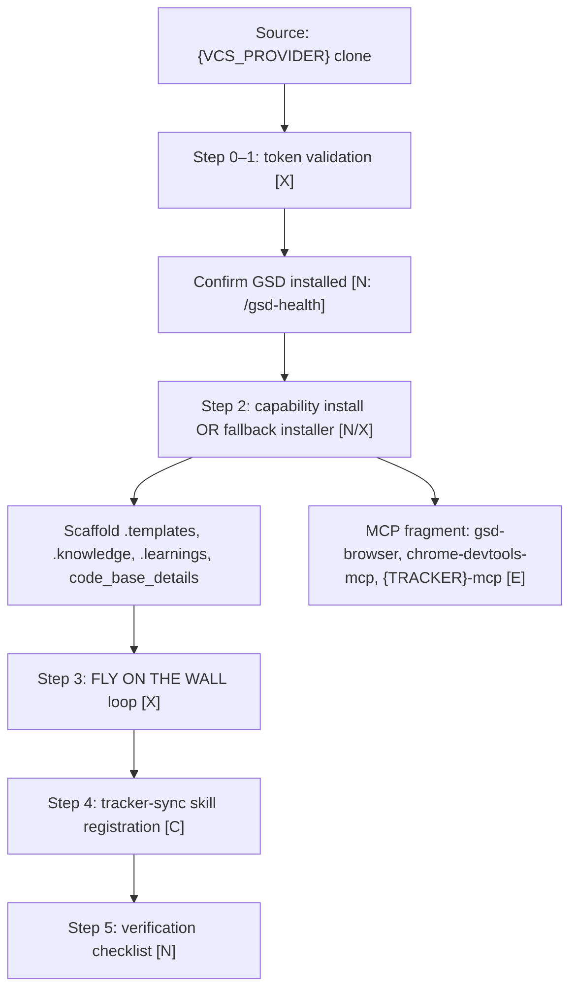

# NetApp GSD Recipe — Install LLD (p0)

Implementer spec for `install.sh` and bootstrap. Overview: [ARCHITECTURE.md](../ARCHITECTURE.md). Run flow: [README.md](../README.md).

**Scope:** One-time, idempotent bootstrap on any target repo. GSD core remains orchestrator.

Related: [RUNTIME-LLD.md](RUNTIME-LLD.md) · [OBSERVER-LLD.md](OBSERVER-LLD.md) · [TRACEABILITY-LLD.md](TRACEABILITY-LLD.md) · [DATA-CONTRACTS.md](../contracts/DATA-CONTRACTS.md) · [BACKLOG.md](../BACKLOG.md)

---

## Legend

| Tag | Meaning |
|-----|---------|
| **[N]** | Native GSD command or artifact — use as-is |
| **[C]** | Configure GSD (config, `agent_skills`, templates) — no new runtime |
| **[X]** | Net-new build for this recipe |
| **[E]** | External extension / MCP server (pluggable per repo) |

---

## Parameters (codebase-agnostic)

| Parameter | Example values | Purpose |
|-----------|----------------|---------|
| `{VCS_PROVIDER}` | `github` (v1) | Git host for clone/push/PR |
| `{TRACKER}` | `jira`, `github_issues`, `linear` | Issue tracker for epic/tasks/comments |
| `{VCS_TOKEN}` | env var / secret store | Authenticate to `{VCS_PROVIDER}` |
| `{TRACKER_TOKEN}` | env var / secret store | Authenticate to `{TRACKER}` (may equal `{VCS_TOKEN}` when tracker is built-in) |
| `{ORG_REVIEW_BOT}` | org-specific | Optional PR review bot (not installed here) |

Never commit tokens. Reference only via env vars or the host secret manager.

---

## Goals

1. Install recipe scaffolding without forking GSD core.
2. Validate credentials and scopes before any write.
3. Establish OKF-conformant knowledge and learnings folders.
4. Register MCP extensions and tracker-sync capability.
5. Install FLY ON THE WALL observer (background loop — see [OBSERVER-LLD.md](OBSERVER-LLD.md)).
6. Prove install health via native GSD checks.

---

## Install flow



---

## Step −1: Source

| | |
|--|--|
| **Inputs** | Repository URL on `{VCS_PROVIDER}`; operator has clone access |
| **Outputs** | Local git working copy |
| **Artifacts** | `.git/` |
| **Human gates** | None |
| **Failure handling** | Fail if clone/auth fails; do not scaffold into a non-git directory |
| **Stamps** | None |

After a successful interactive fallback install,
`install-recipe-to-target.sh` opens the official Cursor prompt deeplink
`cursor://anysphere.cursor-deeplink/prompt?text=recipe-start`. Cursor pre-fills
the focused chat but never executes the prompt; the operator reviews it and
presses Enter. The deeplink cannot guarantee a separate new Agent chat or bind
another workspace. Non-interactive installs skip it by default; flags:
`--open-start` / `--no-open-start`.

---

## Step 0: Credentials

| | |
|--|--|
| **Inputs** | `{VCS_TOKEN}`, `{TRACKER_TOKEN}` (or single token when shared) |
| **Outputs** | Validated credential handles (not persisted in repo) |
| **Artifacts** | None in repo |
| **Human gates** | Operator supplies secrets |

### Required scopes (minimum)

| Provider type | Typical scopes |
|---------------|----------------|
| `{VCS_PROVIDER}` | read/write repo, open PR/MR, read metadata |
| `{TRACKER}` | read issues, create issues, comment, transition (if used) |

---

## Step 1: Token validation [X]

| | |
|--|--|
| **Inputs** | `{VCS_TOKEN}`, `{TRACKER_TOKEN}`, `{VCS_PROVIDER}`, `{TRACKER}` |
| **Outputs** | Pass/fail report with scope gaps |
| **Artifacts** | Optional: `.gsd-recipe/install-report.json` (gitignored, local only) |
| **Human gates** | Operator fixes missing scopes before continuing |
| **Failure handling** | **Fail closed** — no scaffold, no MCP registration, no observer start |
| **Stamps** | None |

**Checks:**

1. Token exists in environment or secret store.
2. API probe succeeds (e.g. `GET /user` equivalent on VCS; `GET issue` on tracker).
3. Scope probe: can read target repo/project; can create comment (dry-run or test issue in sandbox).
4. Optional: verify GSD version supports required commands (`/gsd-surface status`, `/gsd-health`, `/gsd-autonomous` if auto-loop enabled).

**Implementation note:** Small preflight script or agent checklist. No stack-specific assumptions.

---

## Step 2: Capability manifest / installer

### Preferred path [N]

```bash
gsd capability install <gsd-recipe> --scope project --yes
```

Uses GSD capability ecosystem ([ADR-1244](https://github.com/open-gsd/gsd-core/blob/next/docs/adr/1244-capability-ecosystem.md)): versioned manifest, consent-gated `mcpServers`, ledger-tracked files.

**Feasibility caveat:** Capability URL import / project overlay may not be shipped on all GSD versions. If `gsd capability install` is unavailable, use **fallback installer** below.

### Fallback path [X]

Idempotent shell installer:

```bash
./.gsd-recipe/scripts/install.sh --scope project
```

Writes the same directory tree; records installed files in `.gsd-recipe/ledger.json` for clean removal.

For an external target, each install/reinstall writes the absolute source
clone currently running the installer to `.gsd-recipe/config.json` as
`recipe_source`. It is deliberately refreshed rather than write-once: rerunning
from a moved or newly cloned recipe source repairs stale machine-local paths.
Self-installs omit the key because all recipe files are already local.

### Directory tree (created or updated)

Machine-readable schema/examples for these paths live in [DATA-CONTRACTS.md](../contracts/DATA-CONTRACTS.md).

```
.templates/                    # gitignored — recipe templates (local install)
  PRD.template.md
  SPEC.template.md
  TDD.template.md
  {TRACKER}-comment.template.md      # v1: jira-comment.template.md
  {VCS_PROVIDER}-pr-comment.template.md  # v1: github-pr-comment.template.md
  bare_metal.template.md       # [X] env bootstrap runbook
```

**Template sources (v1):** install copies from bundled harness skeletons — [jira-comments/_comment.template.md](../reference/harness/recipe/templates/jira-comments/_comment.template.md) → `.templates/jira-comment.template.md`; [github-pr-comments/_comment.template.md](../reference/harness/recipe/templates/github-pr-comments/_comment.template.md) → `.templates/github-pr-comment.template.md`. See [TRACEABILITY-LLD](TRACEABILITY-LLD.md) § Templates.

```
.knowledge/                    # gitignored — OKF v0.1 bundle [E]
  index.md                     # OKF reserved
  log.md                       # OKF reserved
  architecture/
  dependency-graph/
  hot-files/
  risk-register/
  dag/                           # populated at runtime — see RUNTIME-LLD

code_base_details/             # gitignored — human-authored repo context
  README.md                    # "what to put here"

.learnings/                    # gitignored — OKF-shaped observer output
  observer/
    ticks.jsonl
  sessions/
  kb/
    playbooks/

.gsd-codebase/                 # gitignored — owned by GSD core [N]
.planning/                     # gitignored — GSD native working state [N]

.gsd-recipe/                # gitignored — recipe metadata (reinstall per clone)
  capability.json             # [X] TASK-011 — generated by bench/lib/capability-schema.sh generate-capability
  capability.schema.json      # [X] TASK-011
  config.schema.json          # [X] TASK-011 — validates config.json below
  ledger.json                  # fallback installer only
```

**TASK-011 status:** `capability.json`/`config.schema.json` (deferred by `install.sh`'s own header comment — see `.gsd-recipe/scripts/install.sh` line ~17) are now built as standalone artifacts + a validation/generation library (`bench/lib/capability-schema.sh`), not yet wired into `install.sh`'s own flow (that composition is left for a follow-up integration pass — see `bench/report/capability-config-schema-integration-report.md`'s exact snippet for what to add).

### `.gitignore` additions [C]

Recipe scaffold is **local-only by default** (not committed with product/feature work). Re-run install on each clone, or keep a separate chore PR if a team wants the scaffold shared.

```gitignore
.learnings/
.gsd-codebase/
.gsd-recipe/
.knowledge/
.templates/
.planning/
code_base_details/
skills/
docs/RECIPE-COMMANDS.md
docs/RECIPE-BENCHMARKS.md
```

**Not** a blanket `docs/*` — that would hide product docs in the target repo. Only recipe-owned doc filenames are ignored. Cursor skills under `.cursor/skills/` follow whatever `.cursor/` policy the target already uses (installer also adds specific `.cursor/gsd-*` ignores). `.planning/` is GSD-native working state (plans, STATE, ROADMAP) — local-only by default so feature PRs stay free of agent planning artifacts.

### OKF convention [E]

All knowledge files under `.knowledge/` and promoted playbooks use [Open Knowledge Format v0.1](https://github.com/GoogleCloudPlatform/knowledge-catalog/blob/main/okf/SPEC.md) (local-only by default — see `.gitignore` additions above):

- YAML frontmatter with required `type`
- Optional: `title`, `description`, `resource`, `tags`, `timestamp`
- `index.md` and `log.md` at bundle root

### `code_base_details/` [C]

Manual operator content: runbooks, architecture notes, onboarding quirks. Ingested at runtime via **[N]** `/gsd-ingest-docs --manifest .gsd-recipe/ingest-manifest.yaml`.

**Rule:** If directory exists, **update only** — installer does not overwrite human files.

### `bare_metal.template.md` [X]

Stack-agnostic bootstrap contract. Each repo fills:

```markdown
## Bootstrap commands (repo-specific — human-authored)
- install_deps: `<command>`
- build: `<command>`
- unit_tests: `<command>`
- smoke: `<command>`
- dev_server: `<command>` (optional)

## Success criteria
- All commands exit 0
- smoke output contains: `<substring>` (optional)
```

**Feasibility caveat:** Truly zero-touch bootstrap across all stacks is hard. Expect per-repo human authorship of commands; installer provides the template only.

### MCP extensions [E]

Registered via capability manifest `mcpServers` fragment (consent at install):

| Server | Role |
|--------|------|
| `gsd-browser` | Deterministic UAT — **[N]** companion to `/gsd-verify-work` |
| `chrome-devtools-mcp` | Perf trace, console/network debug — pairs with `/gsd-ui-review`, `/gsd-debug` |
| `{TRACKER}-mcp` | Atlassian / GitHub / Linear — tracker ops |

Config shape (example):

```json
{
  "mcpServers": {
    "chrome-devtools": {
      "command": "npx",
      "args": ["-y", "chrome-devtools-mcp@latest"]
    }
  }
}
```

The fallback installer prints this fragment only; it never edits Cursor's
shared `mcp.json`. Its paste checklist tells the operator to open Cursor
Settings > Tools & MCP, merge the fragment without replacing existing servers,
restart the Agent in a new chat, and confirm the server's tools are listed.

### Populate `.knowledge/` from GSD [N]

After install, operator or agent runs (once per repo, refresh on major change):

```text
/gsd-map-codebase [--fast]
/gsd-graphify build
/gsd-ingest-docs --manifest .gsd-recipe/ingest-manifest.yaml
```

Outputs land under `.knowledge/` and `.planning/intel/` per GSD defaults; recipe copies or links summaries into OKF paths.

| | |
|--|--|
| **Inputs** | Capability package or fallback installer; repo root |
| **Outputs** | Scaffolded tree; MCP registration; `.gsd-recipe/capability.json` |
| **Artifacts** | See directory tree |
| **Human gates** | Consent prompt for executable MCP surfaces (capability install) |
| **Failure handling** | Partial install → reconciliation via ledger; re-run is idempotent |
| **Stamps** | None at install |

---

## Step 3: FLY ON THE WALL install [X]

| | |
|--|--|
| **Inputs** | [OBSERVER-LLD.md](OBSERVER-LLD.md); Cursor `/loop` or Automation config |
| **Outputs** | Background observer registered; interval configured |
| **Artifacts** | `.gsd-recipe/observer-config.json`; `.learnings/observer/` (created empty) |
| **Human gates** | Operator approves automation/loop creation |
| **Failure handling** | If loop unavailable, degrade to manual `/gsd-capture --note` (document in install report) |
| **Stamps** | None |

**Design:** Self-driving background loop — not hook-only. See OBSERVER-LLD for tick schema and rollup.

**Feasibility caveat:** Signal quality needs iteration; install only wires plumbing.

---

## Step 4: Tracker-sync registration [C]

| | |
|--|--|
| **Inputs** | `{TRACKER}` adapter; event catalog; comment templates |
| **Outputs** | `tracker-sync` skill/capability registered; `events.json` bound to `{TRACKER}` |
| **Artifacts** | `.cursor/skills/tracker-sync/SKILL.md` (or capability-owned equivalent); `.templates/{TRACKER}-comment.template.md` |
| **Human gates** | None at install |
| **Failure handling** | If `{TRACKER}-mcp` auth fails, install completes but runtime sync is disabled (flag in `.gsd-recipe/config.json`) |
| **Stamps** | None |

Contract: [TRACEABILITY-LLD.md](TRACEABILITY-LLD.md). Reference: [README.md](../README.md) · [reference/skills/gsd-jira-sync/](../reference/skills/gsd-jira-sync/).

---

## Step 5: Verification checklist [N]

Run after install; all must pass before declaring p0 complete.

| # | Check | Command / action | Tag |
|---|-------|------------------|-----|
| 1 | GSD integrity | `/gsd-health [--repair]` | [N] |
| 2 | Context headroom | `/gsd-health --context` | [N] |
| 3 | Capability surface | `/gsd-surface status` or `gsd capability list --json` | [N] |
| 4 | Token still valid | Re-run step 1 probes | [X] |
| 5 | Templates present | Assert `.templates/*.md` exist | [C] |
| 6 | OKF index | Assert `.knowledge/index.md` exists | [C] |
| 7 | Gitignore | Scaffold local-only: `.gsd-recipe/`, `.knowledge/`, `.templates/`, `.planning/`, `code_base_details/`, `skills/`, recipe docs, `.learnings/`, `.gsd-codebase/` | [C] |
| 8 | MCP reachable | Smoke: list tools on `{TRACKER}-mcp` (optional) | [E] |
| 9 | Observer loop | Confirm loop/automation scheduled (optional v1) | [X] |
| 10 | Bare metal Gate A | Run `bare_metal` bootstrap commands once | [X] |

| | |
|--|--|
| **Inputs** | Completed install |
| **Outputs** | `INSTALL-VERIFIED` marker in `.gsd-recipe/install-report.json` or operator sign-off |
| **Artifacts** | `.knowledge/bootstrap-status.json` — OKF doc, `type: Bootstrap Status` |
| **Human gates** | Operator signs off if Gate A fails (document known env debt) |
| **Failure handling** | Block p1 usage until checks 1–7 pass; 8–10 may warn-only |
| **Stamps** | Optional: `started` @ `intake` when linked to tracker epic at project kickoff |

`recipe-install-verify` is the agent-mediated install doctor. When the
configured tracker is Jira, it performs a live, non-mutating Atlassian MCP
probe. On success it runs `install.sh --record-jira-check pass` and immediately
reruns `install.sh --verify` in the same Agent turn, allowing that script to
write `.gsd-recipe/INSTALL-VERIFIED.json`. If MCP is unavailable, `jira_check`
stays `pending` and shell verification remains fail-closed. The
`--record-jira-check` mode remains available for scripts and CI.

---

## `agent_skills` injection [C]

Add to `.planning/config.json` (or workstream config):

```json
{
  "agent_skills": {
    "gsd-planner": ["skills/recipe-planning-policy"]
  }
}
```

Every listed path must be a directory actually staged with a `SKILL.md`; the
current bundle stages only `skills/recipe-planning-policy` for this mechanism.
The installer prints but never auto-edits this GSD-owned config. Merge the
snippet into `.planning/config.json`, preserve existing keys, restart the
Agent, then run `gsd-surface status` and confirm the planner lists the policy.

---

## Removal / upgrade

| Action | Mechanism |
|--------|-----------|
| Upgrade recipe | **`recipe-update`** (TASK-058, planned) — restage from `recipe_source` without uninstall; until then: re-run `install-recipe-to-target.sh` / `install.sh` (idempotent restage) or `gsd capability update gsd-recipe` when capability install exists |
| Remove recipe | `gsd capability remove gsd-recipe --purge-data` or `install.sh --uninstall` via ledger |
| Preserve human data | `code_base_details/`, `.knowledge/` (review before delete) |

---

## Open decisions

Primary source: [DECISIONS.md](../DECISIONS.md).

| Topic | Current default |
|-------|-----------------|
| Capability vs fallback installer | Capability-first, fallback when unavailable |
| Observer interval | 5–10 min |
| Gate A strictness | Warn on fail (policy can harden) |

---

## See also

- [ARCHITECTURE.md](../ARCHITECTURE.md) — phase model
- [README.md](../README.md) — commands + run flow
- [TRACEABILITY-LLD.md](TRACEABILITY-LLD.md) § Tracker adapter ops
- [PLANNING-POLICY.md](PLANNING-POLICY.md) — mandatory plan sections
