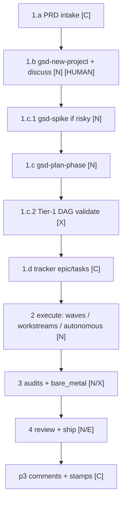

# NetApp GSD Recipe — Runtime LLD (p1)

Implementer spec for p1 wrappers, DAG, gates, and phase loops. Overview: [ARCHITECTURE.md](../ARCHITECTURE.md). Commands: [README.md § Commands](../README.md#commands).

Related: [INSTALL-LLD.md](INSTALL-LLD.md) · [OBSERVER-LLD.md](OBSERVER-LLD.md) · [TRACEABILITY-LLD.md](TRACEABILITY-LLD.md) · [PLANNING-POLICY.md](PLANNING-POLICY.md)

---

## Legend

| Tag | Meaning |
|-----|---------|
| **[N]** | Native GSD |
| **[C]** | Recipe configuration on top of GSD |
| **[X]** | Net-new for this recipe |
| **[E]** | External extension |

---

## Runtime overview



**Principle:** GSD stays orchestrator. Recipe adds gates, DAG metadata, tracker linkage, and bootstrap — does not replace `gsd-plan-phase` / `gsd-execute-phase`.

**Quality floor:** **CI green + human PO** for `settled`. Benchmark harness may use project grader when registered — **not** `gsd-verify-work` alone ([README.md](../README.md)).

---

## 1. Discuss, design, plan

### 1.a PRD intake [C]

| | |
|--|--|
| **Inputs** | User PRD file (Jira/Confluence export, canonical PRD, or freeform), tracker epic body, or freeform intent |
| **Outputs** | PRD conforming to `.templates/PRD.template.md` |
| **Artifacts** | `docs/PRD.md` or `.planning/intake/PRD.md`; optional `{TRACKER}` epic key in `.planning/STATE.md` |
| **Human gates** | Operator confirms scope when template was incomplete and agent asked clarifying questions |
| **Failure handling** | Missing required PRD sections → block `gsd-plan-phase` until discuss completes |
| **Stamps** | `started` @ `intake` when epic linked — see [TRACEABILITY-LLD.md](TRACEABILITY-LLD.md) |

**Paths:**

| Input shape | Action |
|-------------|--------|
| PRD matches template | Consume as-is → discuss |
| PRD partial | Agent Q&A until template complete |
| No PRD | **[N]** `gsd-discuss-phase` produces equivalent structure |
| Existing repo docs | **[N]** `gsd-ingest-docs --manifest .gsd-recipe/ingest-manifest.yaml` |

**Future:** PRD → `{VCS_PROVIDER}` issue (stub in template; not required for v1).

---

### 1.b Project bootstrap [N] + human gate

| | |
|--|--|
| **Inputs** | PRD or discuss output |
| **Outputs** | `PROJECT.md`, `ROADMAP.md`, `.planning/STATE.md` |
| **Artifacts** | `.planning/*` native tree |
| **Human gates** | **Required:** discuss / scope approval before planning |
| **Failure handling** | `gsd-health --repair` if `.planning/` corrupt |
| **Stamps** | `intake_started` → `prd-approved` after discuss |

```text
gsd-new-project          # or gsd-import for external plans
gsd-discuss-phase N      # fills CONTEXT.md
```

#### 1.b.1 Frontend design [N]

| Condition | Action |
|-----------|--------|
| FE in scope + Figma/design URL provided | Reference in `CONTEXT.md` |
| FE in scope + no design | **[N]** `gsd-sketch` → optional skill wrap-up |

---

### 1.c Planning [N]

**`recipe-plan-phase` (TASK-017)** implements this row in narrowed form: a single-phase
gate-and-invoke wrapper that determines first-plan vs re-plan (informational, via a `PLAN.md`
glob), resolves the phase's tracker issue key, calls native `gsd-plan-phase N` directly, then runs
a read-only post-hoc soft warn-and-confirm planning-policy compliance check + non-blocking
`depends_on`/`touches` reminder, and syncs `plan_complete`/`plan_revised` via `gsd-jira-sync` — no
DAG topo-sort/cycle-detection algorithm (parked, see 1.c.2.c below) and no pre-req/post-op
eligibility gating (parked, see 1.c.2.a/b below). See
[bench/report/recipe-plan-phase-integration-report.md](../../../bench/report/recipe-plan-phase-integration-report.md).

| | |
|--|--|
| **Inputs** | `CONTEXT.md`, `.knowledge/`, `code_base_details/`, learnings playbooks (if any) |
| **Outputs** | `PLAN.md` per phase with mandatory 7 sections ([PLANNING-POLICY.md](PLANNING-POLICY.md)) |
| **Artifacts** | `.planning/phases/NN-*/NN-*-PLAN.md` |
| **Human gates** | Plan approval before execute (configurable; default **on**) |
| **Failure handling** | Plan-checker loop → `plan_revised` event |
| **Stamps** | `engineering-ready` @ `prd-to-stories` on `plan_complete` |

```text
gsd-plan-phase N
```

Plans **must** include (recipe [C] enforces via `agent_skills` on `gsd-planner`):

1. Problem restatement  
2. Proposed approach  
3. Security considerations  
4. Performance considerations  
5. Expected review concerns  
6. Validation / testing strategy (**CI required**; benchmark grader when registered)  
7. Learning extraction opportunities  

Plus **DAG frontmatter** (below).

---

### 1.c.1 Spike before plan (risky work) [N]

| | |
|--|--|
| **Inputs** | Uncertain feasibility, unknown API, perf unknown |
| **Outputs** | Spike verdict: VALIDATED / INVALIDATED / PARTIAL |
| **Artifacts** | Spike notes under `.planning/spikes/` |
| **Human gates** | Operator accepts spike verdict before plan finalization |
| **Failure handling** | INVALIDATED → revise ROADMAP or descope |
| **Stamps** | Optional note on `plan_complete` comment |

```text
gsd-spike "can we X with Y"
gsd-spike --quick "alternative comparison"
```

---

### 1.c.2 Phase gates + Tier-1 DAG

#### Pre-req (1.c.2.a) [N + X]

**Status:** parked pending TASK-009 (`dag-build.sh`, not required for v1 — see
[DECISIONS.md](../DECISIONS.md)). `recipe-run-phase` (TASK-024) does not implement this gate — it
never reads/writes `.knowledge/dag/state.json`; it only prints a `depends_on` reminder from
`PLAN.md` frontmatter as an informational, non-blocking note. `recipe-plan-phase` (TASK-017)
likewise does not implement this gate — same parked status, same print-only `depends_on`/`touches`
reminder pattern, never reads/writes `.knowledge/dag/*`.

| | |
|--|--|
| **Inputs** | DAG state; `depends_on` from each `PLAN.md` |
| **Outputs** | Phase eligible / blocked |
| **Artifacts** | `.knowledge/dag/state.json` |
| **Human gates** | None (automated) |
| **Failure handling** | Block execute if upstream not `verified` |
| **Stamps** | None |

**Rule:** Phase N may start only when every `depends_on` phase is `verified` in DAG state (set by post-op).

**Native pre-req:** Plan-checker gate inside **[N]** `gsd-plan-phase` (plan quality, not cross-phase deps).

#### Post-op (1.c.2.b) [N]

**Status:** parked pending TASK-009, same as 1.c.2.a above. `recipe-run-phase` (TASK-024) never
writes a DAG `verified` status — its own `execute_complete` stamp (§2.a below) is unrelated to
this DAG post-op and carries no DAG-eligibility meaning. `recipe-plan-phase` (TASK-017) is
upstream of this post-op entirely (it only ever plans a phase, never executes/verifies one) and
also never writes DAG state.

| | |
|--|--|
| **Inputs** | Phase execution + verification artifacts |
| **Outputs** | Phase marked `verified` in DAG; audit reports |
| **Artifacts** | `{phase}-VERIFICATION.md`, `{phase}-UAT.md` |
| **Human gates** | UAT sign-off per `gsd-verify-work` |
| **Failure handling** | Failed audit → rework path (2.c) |
| **Stamps** | `build-done`; `verify_complete` comment |

```text
gsd-audit-uat
gsd-audit-fix [--severity high]   # optional auto-fix
```

On success: update DAG node status → `verified`.

#### Parallel vs sequential (1.c.2.c) — Tier-1 DAG [X]

**Build now:** static graph — topo-sort, cycle detection, file conflict detection.  
**Parked (phase 2):** autonomous concurrent execution with worktree orchestration + auto-merge.

##### PLAN.md frontmatter schema

```yaml
---
phase_id: 03-payments
depends_on: [01-auth, 02-schema]    # phase_id list; empty = no deps
touches:                             # glob ownership claims
  - src/payments/**
  - db/migrations/003_*
---
```

##### Algorithm

1. Collect all `phase_id`, `depends_on`, `touches` from phase `PLAN.md` files.
2. Build directed graph; run **Kahn topological sort**.
3. **Cycle detection:** if cycle found → **block planning**, emit `.knowledge/dag/CYCLE-ERROR.md` (OKF, `type: DAG Error`).
4. **Conflict detection:** for each pair of phases with **no** dependency path between them, intersect `touches` globs. Non-empty intersection → flag `serialize` recommendation; empty → flag `parallel_candidate` for `/gsd-workstreams`.
5. Emit `.knowledge/dag/graph.json` + Mermaid snippet for `ROADMAP.md`.

| | |
|--|--|
| **Inputs** | All phase `PLAN.md` frontmatter |
| **Outputs** | `graph.json`, execution order, conflict report |
| **Artifacts** | `.knowledge/dag/graph.json`, `.knowledge/dag/conflicts.md` |
| **Human gates** | Operator resolves conflicts (merge phases or serialize) before parallel workstreams |
| **Failure handling** | Cycles → hard block; conflicts → warn + require explicit override in `STATE.md` |
| **Stamps** | None |

**Implementation:** Single script `dag-build.sh` or `gsd-tools` subcommand — no execution engine.

---

### 1.d Tracker epic + tasks [C]

| | |
|--|--|
| **Inputs** | PRD, ROADMAP phases, DAG order |
| **Outputs** | Epic + one task per phase (or per story — team config) |
| **Artifacts** | `.planning/STATE.md` tracker section; task keys |
| **Human gates** | Optional: human confirms epic/task mapping |
| **Failure handling** | Tracker API fail → continue GSD work; queue sync retries |
| **Stamps** | `started` @ intake; `engineering-ready` per phase at `plan_complete` |

Adapter ops: `create_subissue`, `link` — [TRACEABILITY-LLD.md](TRACEABILITY-LLD.md) § Tracker adapter.

Create standard phase Tasks with the Epic in Jira's native Parent field whenever live create
metadata exposes it. Use the legacy Epic Link custom field only as an explicit compatibility
fallback; generic issue links do not satisfy hierarchy. Verify the relationship before recording
the task key. Active/review child work moves a To Do Epic to In Progress; settling a phase marks
its task Done; the Epic moves to Done only when all phase tasks recorded in STATE have Jira status
category `done`.

```markdown
## Tracker
- epic: {EPIC_KEY}
- issue: {PHASE_TASK_KEY}
- system: {TRACKER}
```

---

## 2. Build

### 2.a Execute [N]

**`recipe-run-phase` (TASK-024)** implements this row in narrowed form: a single-phase
gate-and-invoke wrapper that resolves `PLAN.md`, runs a read-only soft planning-policy compliance
check + non-blocking `depends_on` reminder, syncs `execute_started`/`execute_complete` via
`gsd-jira-sync`, then calls native `gsd-execute-phase N [--wave W]` directly — no DAG eligibility
check (parked, see 1.c.2.a above) and no `execute_wave` handling (left entirely to
`gsd-execute-phase` itself). See
[bench/report/recipe-run-phase-integration-report.md](../../../bench/report/recipe-run-phase-integration-report.md).

| | |
|--|--|
| **Inputs** | Approved `PLAN.md`; DAG eligibility |
| **Outputs** | `SUMMARY.md`, commits, `VERIFICATION.md` |
| **Artifacts** | `.planning/phases/NN-*/NN-*-SUMMARY.md` |
| **Human gates** | Config: `workflow.auto_advance` — default **semi-auto** (human approves plan, not every wave) |
| **Failure handling** | Package install checkpoint → human verify ([N] executor behavior) |
| **Stamps** | `build-started`, `build-done`; optional `execute_wave` |

```text
gsd-execute-phase N
gsd-execute-phase N --wave 2
gsd-execute-phase N --validate
```

**Parallelism:**

| Mechanism | Use |
|-----------|-----|
| `--wave` | Intra-phase parallel tasks (plan-defined) |
| `gsd-workstreams` | Independent DAG branches marked `parallel_candidate` |

```text
gsd-workstreams create backend-api
gsd-workstreams switch backend-api
```

---

### 2.b Auto-loop across phases [N]

| | |
|--|--|
| **Inputs** | Remaining phases; human gate config |
| **Outputs** | Sequential phase completion |
| **Artifacts** | Per-phase summaries |
| **Human gates** | **Recommended:** gate auto-loop behind plan approval + CI green per phase |
| **Failure handling** | Stop on plan-check / verifier / checkpoint failure |
| **Stamps** | Per-phase build stamps |

```text
gsd-autonomous --from 3 --to 5
gsd-autonomous --converge --max-cycles 5   # optional cross-AI plan convergence
```

**Feasibility caveat:** Full unattended autonomy can conflict with "human review is a feature" ([PLANNING-POLICY.md](PLANNING-POLICY.md)). Default to semi-auto.

---

### 2.c Rework when prereq fails [N]

| | |
|--|--|
| **Inputs** | Failed verification; broken downstream prereq |
| **Outputs** | Upstream phase re-executed |
| **Artifacts** | `gsd-thread` context; updated SUMMARY |
| **Human gates** | Operator confirms rework scope |
| **Failure handling** | `reopened` stamp + tracker comment |
| **Stamps** | `reopened` |

```text
gsd-thread "revisit phase 02-schema for migration fix"
gsd-autonomous --only 2
```

---

### 2.d No test regressions [C]

| | |
|--|--|
| **Inputs** | Plan validation section; CI config |
| **Outputs** | CI green |
| **Artifacts** | CI logs |
| **Human gates** | None if CI enforced |
| **Failure handling** | Block phase post-op / ship |
| **Stamps** | Note in `execute_complete` comment |

Recipe does not replace CI. Plan must declare test commands.

---

## 3. Verify

### 3.a Milestone completion [N]

```text
gsd-audit-milestone
```

| | |
|--|--|
| **Outputs** | Gap analysis vs ROADMAP DoD |
| **Stamps** | None (feeds settle gate) |

### 3.b Cross-phase UAT [N]

```text
gsd-audit-uat
gsd-audit-fix [--dry-run]
```

### 3.c Manual UAT + bare metal

#### 3.c.1 Bootstrap gates [X]

| Gate | When | Action |
|------|------|--------|
| **Gate A** | End of p0 / start of p1 | Run `bare_metal` commands from filled template |
| **Gate B** | Before manual UAT (3.c) | Re-run bootstrap + phase smoke from `PLAN.md` |

| | |
|--|--|
| **Inputs** | `bare_metal.template.md` (filled per repo) |
| **Outputs** | `.knowledge/bootstrap-status.json` (OKF) |
| **Artifacts** | `type: Bootstrap Status` with command results |
| **Human gates** | Sign-off if env known-broken |
| **Failure handling** | Block UAT; route to 2.c rework |
| **Stamps** | `verify_complete` comment includes bootstrap status |

**Feasibility caveat:** Commands are repo-specific; template is generic.

#### 3.c.2 Recovery loop [N + X]

Reuse **[N]** `/gsd-debug` session pattern for **environment** failures (not only code bugs):

```text
gsd-debug "local dev server won't start after phase 3"
gsd-debug list
gsd-debug continue <slug>
```

| | |
|--|--|
| **Inputs** | Failed bootstrap or UAT |
| **Outputs** | Resolved env or documented blocker |
| **Human gates** | UAT sign-off |
| **Failure handling** | Loop until Gate B passes or operator aborts |
| **Stamps** | `verify_complete` |

**Browser UAT:** **[E]** `gsd-browser` + optional `chrome-devtools-mcp` per **[N]** `gsd-verify-work` guidance.

```text
gsd-verify-work N
```

---

## 4. Review and ship

### 4.a Code review [N]

```text
gsd-code-review N
gsd-review              # optional cross-AI peer review of plans
gsd-ui-review N         # if FE — pair with browser MCP [E]
```

| | |
|--|--|
| **Outputs** | `REVIEW.md` |
| **Human gates** | Security / perf / design per [PLANNING-POLICY.md](PLANNING-POLICY.md) |
| **Stamps** | `approved` @ `review` |

### 4.b Org review bot [E]

`{ORG_REVIEW_BOT}` on PR — pluggable; out of recipe core.

### 4.c Ship [N]

```text
gsd-ship N [--draft]
```

| | |
|--|--|
| **Prerequisites** | `gsd-verify-work` passed for phase |
| **Outputs** | PR with body from ROADMAP/SUMMARY/REQ-IDs |
| **Human gates** | **PO accept + CI green** before `settled` (grader optional in harness) |
| **Stamps** | `settled` @ `review` |

**Incremental PR comments during build:** see [TRACEABILITY-LLD.md](TRACEABILITY-LLD.md) (v1 gap).

---

## Learnings hook (p1 → p2)

After phase or milestone:

```text
gsd-extract-learnings N
```

Feeds [OBSERVER-LLD.md](OBSERVER-LLD.md) promotion path. Stamp: `kb-updated`.

---

## Failure handling summary

| Failure | Response |
|---------|----------|
| DAG cycle | Block plan/execute; fix `depends_on` |
| File conflict (parallel) | Serialize or split workstreams |
| Plan-check fail | Revise plan; `plan_revised` |
| Execute checkpoint | Human verify package |
| Bootstrap fail | `gsd-debug` loop; no UAT |
| CI fail | Block ship; no `settled` |
| Tracker sync fail | Continue GSD; retry sync |
| Benchmark grader fail (harness only) | `reopened`; no `settled` |

---

## KPI stamps (p1)

| Milestone | `step` | `status` | Typical `actor` |
|-----------|--------|----------|-----------------|
| Intake | `intake` | `started` | human |
| Discuss done | `prd` | `prd-approved` | human |
| Plan done | `prd-to-stories` | `engineering-ready` | human |
| Plan revision | `prd-to-stories` | `review-ready` | agent |
| Build start | `build` | `build-started` | agent |
| Build done | `build` | `build-done` | agent |
| Review done | `review` | `approved` | human |
| Accepted | `review` | `settled` | human |
| Rework | any | `reopened` | human |

Emit via `emit-stamp.sh` or tracker-sync skill — [README.md](../README.md).

---

## Tier-2 DAG (parked)

Not in v1:

- Auto-spawn agents per DAG branch
- Git worktree per branch
- Auto-merge + cascade re-verification

Use manual `gsd-workstreams` + human merge until KPIs justify Tier-2.

---

## See also

- [INSTALL-LLD.md](INSTALL-LLD.md)
- [TRACEABILITY-LLD.md](TRACEABILITY-LLD.md)
- [open-gsd/gsd-core COMMANDS.md](https://github.com/open-gsd/gsd-core/blob/next/docs/COMMANDS.md)
